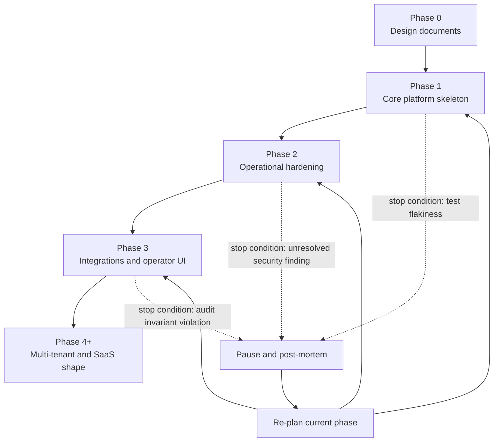

# PHASED_ROADMAP.md

## Purpose

This document describes how InsuranceOps AI is delivered phase by phase.
It fixes the goals, exit criteria, and rough effort shape of each phase;
it defines the engineering workflow that every phase follows;
and it names the conditions under which a phase is halted and re-planned.
Readers should come away knowing what lands when,
what is deliberately deferred,
and how scope changes are processed.

## Scope

This document covers sequencing, exit criteria, engineering workflow,
change management, and stop conditions.
It does not enumerate requirements (see PRODUCT_REQUIREMENTS.md)
or implementation mechanics (see SYSTEM_ARCHITECTURE.md).
It applies to the full product life cycle through Phase 4+,
with decreasing specificity as phases become more speculative.

## Phase summary table

The table below is the compact view.
Each row is expanded into a full subsection below with in-scope work,
out-of-scope for the phase, testable exit criteria, expected risks,
and a rough effort shape in calendar weeks.

| Phase | Goal | Exit criteria | Key deliverables |
|-------|------|---------------|------------------|
| Phase 0 | Architecture and design documents | All 10 design docs merged on `main` via a reviewed PR; no implementation files exist | SPEC.md, PRODUCT_REQUIREMENTS.md, SYSTEM_ARCHITECTURE.md, PHASED_ROADMAP.md, SECURITY_REVIEW.md, OBSERVABILITY_STRATEGY.md, TESTING_STRATEGY.md, DEPLOYMENT_STRATEGY.md, RISK_ANALYSIS.md, TECHNICAL_DEBT_PREVENTION.md, minimal README.md, minimal .gitignore |
| Phase 1 | Core platform skeleton with one end-to-end Workflow | FastAPI app, Postgres schema via Alembic, Redis reliable-queue, worker, `claim_intake_v1` with stub Extractor and rule-based Validator, audit hash chain, bounded retries, EscalationCase flow, structlog plus correlation IDs, `/healthz` and `/readyz` and `/metrics`, Compose stack, CI with lint and type and test and build, pytest suite covering replay, retry bounds, queue processing, audit consistency, and failure paths; all green | Single Docker image, Compose stack, CI workflow, `claim_intake_v1` Workflow, full test suite |
| Phase 2 | Operational hardening | Migration safety review, backup and restore runbooks proven in staging, DLQ inspection endpoints, rate limiting, request-size limits, PII column-level encryption for known fields, secret-management integration with the chosen platform, SLO definitions and error budgets, load-test harness, first staging deploy reachable by ops | Runbooks, `opsctl` commands, SLO docs, load-test harness, staging environment |
| Phase 3 | Integrations and optional operator UI | Model-backed Extractor implemented behind the same interface and proven in staging, minimal server-rendered operator UI (HTMX plus Jinja) for queue triage and resolution, OIDC or SSO for operator users, OTel exporter wired to a real backend | Model-backed Extractor, operator UI, OIDC integration, OTel exporter |
| Phase 4+ | Multi-tenant and SaaS-shape considerations | Tenant isolation model chosen and implemented, per-tenant configuration, multi-region posture (hot spare or active-active decided), capacity planning proven at target tenant count | Tenant-scoped deployment model, multi-region posture, capacity plan |

## Phase 0: Architecture and design documents

### Goal

Produce a cohesive, internally consistent set of architecture documents
that every later phase can reference.
No code, no scaffolding, no implementation files.

### In-scope work

- Author SPEC.md, PRODUCT_REQUIREMENTS.md, SYSTEM_ARCHITECTURE.md,
  PHASED_ROADMAP.md, SECURITY_REVIEW.md, OBSERVABILITY_STRATEGY.md,
  TESTING_STRATEGY.md, DEPLOYMENT_STRATEGY.md, RISK_ANALYSIS.md,
  TECHNICAL_DEBT_PREVENTION.md at the repository root.
- Author a minimal README.md that points at the design documents
  and a minimal `.gitignore` appropriate for the target Python 3.12 plus FastAPI stack.
- Land each document as its own small commit on the `phase-0-architecture` feature branch
  so the history shows believable per-document evolution.
- Open one pull request that merges the feature branch into `main`.

### Out-of-scope for this phase

- No `pyproject.toml`, no `requirements.txt`, no `Dockerfile`,
  no `docker-compose*.yml`, no `alembic.ini`, no `.github/workflows/`,
  no `src/`, no `tests/`.
- No code of any kind.
- No model vendor selection.
- No cloud provider selection.

### Exit criteria (testable)

- `ls` at repository root lists exactly the 10 design documents,
  plus `README.md` and `.gitignore`, plus `.git/` and gitignored `.agents/`.
- `find . -type f \( -name '*.py' -o -name 'Dockerfile' -o -name 'requirements.txt' -o -name 'pyproject.toml' -o -name 'docker-compose*.yml' -o -name 'alembic.ini' \) -not -path './.git/*'`
  prints nothing.
- Every design document contains a `## Purpose`, a `## Scope`,
  and an `## Assumptions` section.
- `git log --oneline main` after the Phase 0 PR merges shows the seed commit
  plus the per-document commits in order.
- The Phase 0 PR passes review.

### Expected risks

- Document drift: one document contradicts another.
  Mitigated by the locked vocabulary in `context.json > architectural_decisions`
  and by cross-document consistency rules.
- Over-specification: designing Phase 2 or Phase 3 details
  that should be decisions made closer to their phase.
  Mitigated by explicit "Dependencies on future decisions" sections.

### Rough effort shape

1 to 2 calendar weeks for a small team that can author in parallel,
2 to 3 weeks for a solo author.

## Phase 1: Core platform skeleton

### Goal

Ship a deployable platform that runs one end-to-end Workflow
(`claim_intake_v1`) from ingest through route to complete,
with a working EscalationCase path, bounded retries, audit hash chain,
structured logs, metrics, and a hermetic deterministic test suite.
Phase 1 is "the skeleton works";
it is not yet "the skeleton is productionized."

### In-scope work

- FastAPI application scaffolded under `src/`
  with the endpoint surface defined in SPEC.md:
  `POST /v1/documents`, `GET /v1/documents/{id}/content`,
  `POST /v1/workflow-runs`, `POST /v1/workflow-runs/{id}/cancel`,
  `GET /v1/workflow-runs/{id}`, `GET /v1/workflow-runs/{id}/events`,
  `GET /v1/escalations`, `POST /v1/escalations/{id}/claim`,
  `POST /v1/escalations/{id}/resolve`, `POST /v1/escalations/{id}/reject`,
  `GET /healthz`, `GET /readyz`, `GET /metrics`.
- Postgres schema managed by Alembic, including tables
  for Document, WorkflowRun, Step, StepAttempt, EscalationCase, AuditEvent,
  and API keys.
- Redis reliable-queue for Tasks,
  with BRPOPLPUSH into an in-flight list, per-worker visibility timeout,
  reaper loop, and explicit acknowledgement.
- Worker process sharing the API process's codebase,
  selected via a `CMD` override on the single Docker image.
- One Workflow definition, `claim_intake_v1`,
  including the stub Extractor and a rule-based Validator.
- AuditEvent hash chain with `prev_event_hash` and `event_hash` columns,
  verifier function, and `opsctl audit verify` command.
- Bounded retries per Step with exponential backoff and jitter.
- One EscalationCase flow end to end: escalate, claim, resolve, reject.
- structlog configured for JSON output with correlation_id,
  workflow_run_id, step_id, step_attempt_id, actor fields
  via contextvars.
- OpenTelemetry no-op bridge that becomes a real exporter
  when `OTEL_EXPORTER_OTLP_ENDPOINT` is set.
- Prometheus metrics at `/metrics` exposing the required series
  listed in SPEC.md § Success criteria.
- Docker Compose definition for local development
  with api, worker, postgres, and redis services.
- GitHub Actions workflow: lint (ruff) plus type (mypy)
  plus test (pytest against service-container Postgres and Redis)
  plus build (docker build, no push).
- pytest suite covering:
  workflow replay determinism,
  retry bounds,
  queue processing with worker crash and reaper recovery,
  audit consistency (exactly one AuditEvent per transition),
  hash-chain tamper detection,
  EscalationCase claim and resolve and reject paths,
  failure paths producing `failed` runs,
  role-based authorization.

### Out-of-scope for this phase

- No model-backed Extractor.
  Phase 1 ships the stub Extractor only.
- No operator UI.
  Operator actions happen via API at Phase 1.
- No OIDC or SSO.
  API keys only.
- No PII column-level encryption.
  PII protection is Phase 2.
- No secret-management platform integration.
  Secrets come from environment variables at Phase 1.
- No rate limiting or request-size limits beyond FastAPI defaults.
- No load-test harness.
- No staging deploy (the target is local Compose and a single reachable box).

### Exit criteria (testable)

- `docker compose up` on a developer machine reaches `/readyz` green within 60 seconds.
- A scripted end-to-end test runs `claim_intake_v1` from ingest to `completed`
  with the stub Extractor.
- A scripted end-to-end test runs `claim_intake_v1` to `awaiting_human`,
  claims and resolves the EscalationCase, and reaches `completed`.
- A scripted end-to-end test runs a Workflow that exhausts retries
  and terminates in `failed`.
- The pytest suite is green on CI with no external network.
- `opsctl audit verify --workflow-run-id <id>` returns zero for a clean run
  and a non-zero exit with the first broken index for a modified run.
- Prometheus `/metrics` exposes the required series.
- `docker build` succeeds in CI and produces the single image.

### Expected risks

- Queue correctness under worker crash:
  getting the visibility timeout and reaper right is subtle.
  Mitigated by explicit tests that kill workers mid-Task
  and assert exactly-one delivery semantics modulo idempotency.
- Hash-chain design mistakes:
  getting the fields in the hash right so replays work.
  Mitigated by the replay test and the tamper-detection test.
- Scope creep into Phase 2 territory:
  temptation to add PII encryption "while we're here."
  Mitigated by strict PR review against this phase's exit criteria.

### Rough effort shape

6 to 10 calendar weeks for a small team.

## Phase 2: Operational hardening

### Goal

Make the Phase 1 skeleton operable by a small ops team
in a staging environment that mirrors production shape.
Phase 2 is "we can run this in staging without flying blind."

### In-scope work

- Migration safety: pre-flight checks,
  backward-compatible migrations by default,
  documented procedures for destructive changes.
- Backup and restore runbooks proven by a drill:
  take a backup, restore it in staging, verify data integrity.
- DLQ inspection endpoints and `opsctl queue dlq` commands.
- Rate limiting on public endpoints.
- Request-size limits on `POST /v1/documents` (configurable).
- PII column-level encryption for the known PII fields
  (SSN, DOB, policy numbers) with a KMS-backed key.
- Secret-management integration with the chosen platform
  (decision is made in this phase and recorded in DEPLOYMENT_STRATEGY.md).
- SLO definitions per endpoint and per Workflow
  with error budgets and burn-rate alerts.
- Load-test harness (`bench/` directory, Locust or k6)
  that produces the numbers referenced in NFR-PERF.
- First staging deploy reachable by ops on the chosen platform.

### Out-of-scope for this phase

- No operator UI.
- No model-backed Extractor.
- No OIDC or SSO.
- No multi-region posture.
- No multi-tenant isolation.

### Exit criteria (testable)

- A staging environment exists and passes the Phase 1 end-to-end tests
  against the real Postgres and Redis instances provisioned there.
- A backup-and-restore drill is recorded in a runbook with a timestamp.
- PII columns in staging show ciphertext on direct inspection;
  the application decrypts correctly via the helper.
- SLO dashboards exist and display current SLI values.
- Load-test reports confirm NFR-PERF numbers on the staging hardware profile.
- `opsctl queue dlq list` and `opsctl queue dlq requeue <task_id>` work.

### Expected risks

- KMS integration mistakes: key rotation and key loss are serious.
  Mitigated by a rotation drill and by never storing keys in git.
- SLO gaming: picking generous SLOs that never alert.
  Mitigated by reviewing SLOs against actual customer impact thresholds.
- Staging drift: staging diverges from production shape over time.
  Mitigated by declaring staging a peer environment in DEPLOYMENT_STRATEGY.md.

### Rough effort shape

6 to 10 calendar weeks.

## Phase 3: Integrations and optional operator UI

### Goal

Plug in real capabilities:
a real model-backed Extractor behind the same interface,
a minimal server-rendered operator UI for queue triage and resolution,
OIDC or SSO for operator users,
and an OTel exporter wired to a real backend.
Phase 3 is "real users use it, not just engineers."

### In-scope work

- A model-backed Extractor implemented against the `Extractor` interface.
  Vendor selection is a decision recorded in SYSTEM_ARCHITECTURE.md in this phase.
  The stub Extractor remains available for tests.
- A minimal operator UI using HTMX plus Jinja, server-rendered from FastAPI.
  Scope: queue list, case claim, case resolve, case reject,
  audit timeline view, workflow run detail.
- OIDC or SSO for operator users, signed session cookies.
- OpenTelemetry exporter wired to a real collector endpoint
  in staging and then in production.

### Out-of-scope for this phase

- No SPA framework.
- No customer-facing UI.
- No multi-tenant isolation.
- No global deploy topology.

### Exit criteria (testable)

- The real Extractor passes the same interface conformance tests
  that the stub Extractor passes.
- A WorkflowRun using the real Extractor completes end to end in staging.
- Operator UI supports: view queue, claim case, resolve case, reject case,
  view audit timeline, view WorkflowRun detail.
- OIDC login works end to end against the chosen provider.
- Traces appear in the real OTel backend with correlation_id propagated.

### Expected risks

- Model cost and latency: real models are slow and expensive.
  Mitigated by timeouts, batch handling, and a clear escalate-on-timeout rule.
- UI scope creep: operator UI grows into a product.
  Mitigated by keeping the UI strictly server-rendered and strictly operator-facing.
- OIDC provider lock-in: choosing a provider that is hard to replace.
  Mitigated by using standard OIDC flows and documenting the provider-specific pieces.

### Rough effort shape

8 to 14 calendar weeks, depending on UI depth and model integration complexity.

## Phase 4+: Multi-tenant and SaaS-shape considerations

### Goal

Support multiple tenants with appropriate isolation
and a multi-region posture if adoption warrants it.
Phase 4+ is intentionally vague:
scope depends on actual tenant count, regulatory surface,
and operational maturity at the time it is entered.

### In-scope work (candidate list)

- Tenant isolation model:
  row-level security, schema-per-tenant, or database-per-tenant.
  The choice is driven by tenant count and regulatory needs at the time.
- Per-tenant configuration:
  per-tenant API keys, per-tenant Workflow definitions,
  per-tenant retention policies.
- Multi-region posture:
  hot spare, active-active, or tenant-pinned regions.
- Capacity planning proven at the target tenant count.
- Tenant lifecycle operations: create, suspend, delete with retention honored.

### Out-of-scope for this phase

- Phase 4+ is not a license to rewrite the platform.
  Existing architectural choices (single service, Postgres source of truth,
  Redis reliable-queue, audit hash chain) remain unless a phase-specific decision
  records a reversal with reasoning.

### Exit criteria (testable)

- Two tenants on the same deployment cannot read each other's Documents,
  WorkflowRuns, or AuditEvents, confirmed by an isolation test.
- Tenant lifecycle operations work end to end.
- Capacity is proven at the target tenant count via a load-test run.

### Expected risks

- Over-engineering: building multi-tenant before there are tenants.
  Mitigated by entering Phase 4+ only when tenant demand is concrete.
- Regulatory surface expansion:
  multi-region deployment may trigger data-residency rules.
  Mitigated by engaging compliance early in the phase.
- Operational cost: multi-region deployment is expensive.
  Mitigated by a capacity plan that includes ops cost.

### Rough effort shape

Indeterminate. Not planned in detail before entering the phase.

## Engineering workflow

The workflow below applies to every phase that produces code (Phase 1 onward)
and, in its documentation form, to Phase 0 as well.

### Branching

- All work happens on feature branches.
  Feature branches are cut from `main` and named descriptively
  (for example `feat/retry-reaper`, `docs/phased-roadmap`).
- Direct commits to `main` are not allowed
  except for the one-time Phase 0 seed commit
  (`chore: initialize repository with README and .gitignore`),
  which exists because a pull request requires a base commit on `main` to merge into,
  and `main` had no commits before repository genesis.
  That commit is documented here so no later reviewer is surprised.

### Commits

- Commits are small and reviewable.
  A document is its own commit; a schema migration is its own commit;
  a bug fix is its own commit.
- Commit messages follow Conventional Commits:
  `feat: `, `fix: `, `chore: `, `docs: `, `refactor: `, `test: `, `ci: `.
- No emoji in commit messages.
  No trailing issue numbers required at Phase 1;
  issue-linking conventions can be added when an issue tracker is in use.
- No squash merges on the design-document branch.
  The per-document history is the point.
- Squash merges are acceptable for feature branches that accumulate
  fix-up commits during review, at the author's discretion.

### Pull requests

- One PR per feature.
  A feature is a coherent unit of work:
  one new Workflow, one new endpoint group, one infrastructure change,
  one refactor with a stated goal.
- PR descriptions state the intent, link to the relevant design document section,
  and list the tests that cover the change.
- PRs require at least one reviewer from outside the author's immediate area.
- PRs do not merge with failing CI.

### CI checks

- Required CI checks on every PR at Phase 1:
  `lint` (ruff), `type` (mypy), `test` (pytest), `build` (docker build).
- Optional but recommended checks at Phase 1:
  `coverage` report, `dependency-audit` report.
- CI is deterministic:
  dependency versions are pinned via a lockfile,
  tests run against service-container Postgres and Redis,
  tests do not open outbound sockets,
  tests use a frozen clock where time matters.

### Release and versioning

- Phase 1 does not version the platform itself (no semver tags).
  The versioning that matters is `workflow_version` on each Workflow,
  which is tracked per WorkflowRun.
- Phase 2 introduces platform-level release tags when the staging deploy
  becomes a peer environment to production.

## Change management

Scope changes between phases follow a deliberate path
so that the documents remain a reliable source of truth.

- **Small change (clarification, typo, added acceptance test)**:
  a PR amends the relevant document directly with a `docs:` commit.
  No decision record required.
- **Medium change (new requirement, adjusted exit criteria, new rejected alternative)**:
  a PR amends the relevant document and records a one-paragraph note
  in the future `decisions/` folder
  (a Phase 2 artifact; at Phase 1 a note at the bottom of the relevant document suffices).
- **Large change (phase exit criteria changed, core design choice reversed)**:
  a PR amends the relevant documents,
  adds a decision record in `decisions/`,
  and requires explicit re-approval from the primary reviewers of the affected phase.
- **Reversal of a rejected alternative**:
  requires a decision record that cites the original rejection,
  states what changed, and names the new exit criteria.

The `decisions/` folder is a Phase 2 artifact.
At Phase 0 and Phase 1 the design documents themselves carry change notes
in a "Change log" section added when the first change lands.

## Stop conditions

A phase is halted and re-planned if any of the following hold for a sustained period
(rule of thumb: one working week without clear progress toward resolution).

- **Sustained test flakiness**:
  the test suite's pass rate on unchanged code drops below 98% across 20 CI runs.
  The platform's deterministic-test invariant is load-bearing;
  flakiness erodes trust faster than features add it.
- **Unresolved security finding**:
  a security finding rated medium or higher remains open past the phase budget.
  Shipping more surface on top of a known finding compounds risk.
- **Observability gap that blocks staging debugging**:
  an operator cannot determine, from logs and metrics and traces,
  why a specific WorkflowRun ended in its observed state.
  Shipping more features into an under-observed system makes incidents harder.
- **Queue correctness incident**:
  a Task is observed to be processed zero times or more than twice without idempotency covering it.
  Queue correctness is load-bearing; stop the phase and fix the substrate.
- **Audit invariant violation**:
  the AuditEvent hash chain fails verification on a real WorkflowRun.
  This is a production-grade stop-the-line condition; the phase halts immediately.

When a stop condition fires, the phase is paused,
a post-mortem is written, and the phased roadmap is re-evaluated
before new feature work resumes.

## Phase sequencing diagram

The following mermaid flowchart shows phase dependencies and the gating transitions.
Phase 1 cannot begin until Phase 0 is merged.
Phase 2 hardening depends on Phase 1 exit.
Phase 3 integrations depend on Phase 2 hardening
because a real model-backed Extractor needs SLOs and load capacity to be meaningful.
Phase 4+ depends on Phase 3 being stable in production for a cohort of real users.

## Timeline shape

The following mermaid gantt gives a rough shape of the phase durations.
Dates are relative (weeks from Phase 0 kickoff, `W0`),
not calendar dates.
The intent is to show proportion, not to promise delivery on a specific day.

```mermaid
gantt
  title InsuranceOps AI phased delivery shape
  dateFormat  X
  axisFormat  W%s
  section Phase 0
  Design documents           :p0, 0, 2
  section Phase 1
  Core platform skeleton     :p1, after p0, 10
  section Phase 2
  Operational hardening      :p2, after p1, 10
  section Phase 3
  Integrations and UI        :p3, after p2, 14
  section Phase 4+
  Multi-tenant considerations:p4, after p3, 20
```

## Assumptions

- The team executing this roadmap is small (single-digit engineers) at Phase 1,
  growing modestly by Phase 3.
  Rough effort shapes scale accordingly;
  they are not person-days and are not firm estimates.
- The team controls its own deploy pipeline
  and can enforce the CI checks listed above.
- The organization accepts the non-goals stated in SPEC.md and PRODUCT_REQUIREMENTS.md;
  attempts to quietly add customer-facing surfaces,
  underwriting, or multi-tenant isolation before Phase 4+
  are treated as scope changes and processed per this document's change management.
- Staging becomes a peer environment at Phase 2.
  Before Phase 2, "staging" is a developer-run Compose stack.
- Phase 3 integrations are gated on Phase 2 maturity.
  Shipping a real model-backed Extractor on a platform without SLOs is not desirable.
- Phase 4+ is entered only when real tenant demand justifies it;
  until then, single-tenant posture is the right operating mode.
- Rough effort shapes assume no sustained stop-condition events.
  A stop-condition event resets the current phase's clock.
