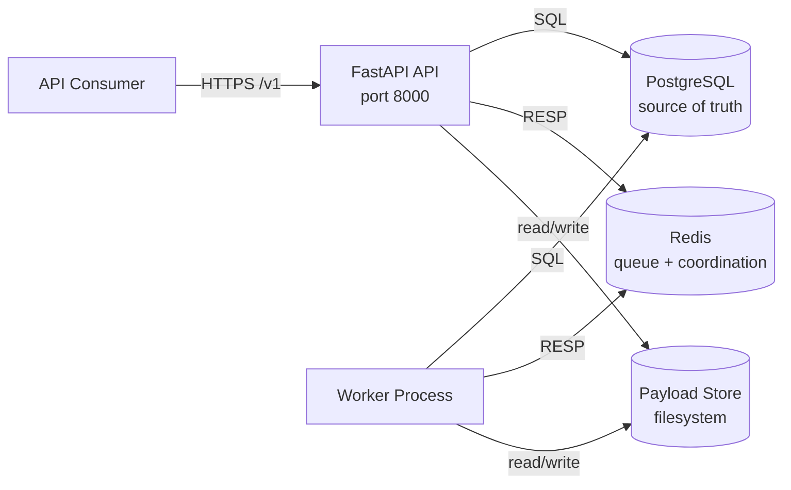

# InsuranceOps AI

An internal, production-grade AI-assisted workflow orchestration platform for insurance back-office operations (document ingestion, extraction, validation, routing, and human escalation) with deterministic execution and full audit trails.

## Architecture Overview



**Single image, two process types.** The platform ships as one Docker image. The `api` process serves the FastAPI control plane. The `worker` process claims tasks, executes step handlers, and runs background loops (reaper, scheduler, outbox relay, audit verifier).

**PostgreSQL is the source of truth.** Every WorkflowRun, Step, StepAttempt, EscalationCase, AuditEvent, and Document lives in Postgres.

**Redis is non-durable coordination.** Task queue, inflight lists, delayed scheduling, rate-limit counters. A full Redis flush is survivable; the outbox relay repopulates from committed Postgres rows.

**Audit hash chain.** Every state transition produces a hash-chained AuditEvent. Tampering with any row is detectable by the verifier.

## Key Capabilities

| Capability | Implementation |
|------------|---------------|
| Document ingestion | `POST /v1/documents` with SHA-256 dedup and content-type validation |
| Workflow orchestration | Versioned workflow definitions with ordered steps |
| Bounded retries | Exponential backoff with jitter, configurable per-step |
| Human escalation | EscalationCase lifecycle: open, claim, resolve/reject, expire |
| Audit trail | Per-run hash chain with tamper detection |
| Rate limiting | Per-API-key fixed-window counters (configurable per role) |
| Observability | Structured JSON logging, Prometheus metrics, OTel-ready tracing |

## Quick Start

```bash
# Boot the stack
docker compose -f compose/compose.yml up -d

# Verify
curl http://localhost:8000/healthz   # {"status":"ok"}
curl http://localhost:8000/readyz    # {"status":"ok"}

# Seed an API key
docker compose -f compose/compose.yml exec api python scripts/seed_dev_data.py
```

See [docs/getting-started.md](./docs/getting-started.md) for the full walkthrough from clone to completed workflow run.

## Documentation

| Guide | Audience |
|-------|----------|
| [Getting Started](./docs/getting-started.md) | New developers — boot to first workflow in 10 minutes |
| [Deployment Guide](./docs/deployment.md) | Operators — configuration, migrations, scaling, troubleshooting |
| [Operations Guide](./docs/operations.md) | Day-to-day — DLQ management, audit verification, escalations |
| [Architecture Diagrams](./docs/architecture/) | Visual — workflow lifecycle, queue topology, worker architecture, audit chain |

## Design Documents

The ten Phase 0 design documents define the platform end to end:

| Document | What it establishes |
| --- | --- |
| [SPEC.md](./SPEC.md) | Product identity, vocabulary, success criteria, non-goals |
| [PRODUCT_REQUIREMENTS.md](./PRODUCT_REQUIREMENTS.md) | Functional and non-functional requirements in testable form |
| [SYSTEM_ARCHITECTURE.md](./SYSTEM_ARCHITECTURE.md) | Every lifecycle, domain model, boundary, storage and queue contract |
| [PHASED_ROADMAP.md](./PHASED_ROADMAP.md) | Phase-by-phase delivery: goals, exit criteria, engineering workflow |
| [SECURITY_REVIEW.md](./SECURITY_REVIEW.md) | Threat model, role boundaries, auth, secrets, PII, audit retention |
| [OBSERVABILITY_STRATEGY.md](./OBSERVABILITY_STRATEGY.md) | Logging contract, metrics surface, tracing, probes |
| [TESTING_STRATEGY.md](./TESTING_STRATEGY.md) | Test suite shape: replay, retry bounds, queue processing, audit consistency |
| [DEPLOYMENT_STRATEGY.md](./DEPLOYMENT_STRATEGY.md) | Packaging, CI/CD, environment contract, migration discipline |
| [RISK_ANALYSIS.md](./RISK_ANALYSIS.md) | Risk register with mitigations, owner-roles, and monitoring signals |
| [TECHNICAL_DEBT_PREVENTION.md](./TECHNICAL_DEBT_PREVENTION.md) | Guardrails, accepted debt with exit criteria, anti-goals |
| [TERMINOLOGY.md](./TERMINOLOGY.md) | Canonical terms, field names, metric names, formatting conventions |

## Repository Layout

```
.
├── compose/                   # Docker Compose topology
├── docker/Dockerfile          # Multi-stage application image
├── docs/                      # Operational and architecture guides
│   ├── architecture/          # Mermaid diagrams
│   ├── getting-started.md
│   ├── deployment.md
│   └── operations.md
├── migrations/                # Alembic schema migrations
├── ops/runbooks/              # Operational runbooks (backup/restore)
├── scripts/                   # opsctl CLI, backup, seed, verification
├── src/insuranceops/          # Application source
│   ├── api/                   # FastAPI routes, schemas, middleware
│   ├── audit/                 # Hash-chain append and verification
│   ├── domain/                # Domain models and pure logic
│   ├── observability/         # Logging, metrics, tracing
│   ├── queue/                 # Redis reliable queue, DLQ, delayed queue
│   ├── security/              # Auth, RBAC, rate limiting, redaction
│   ├── storage/               # SQLAlchemy models, repositories
│   ├── workers/               # Task loop, reaper, scheduler, outbox, verifier
│   └── workflows/             # Definitions, registry, step handlers
└── tests/                     # Unit, integration, workflow, audit tests
```

## Workflow Lifecycle

The `claim_intake` workflow processes insurance documents through five steps:

```
ingest -> extract -> validate -> route -> complete
```

Each step is a bounded-retry unit. On terminal failure with `escalate_on_failure=true`, an EscalationCase opens and the run waits in `awaiting_human` until an operator resolves it.

See [docs/architecture/workflow-lifecycle.md](./docs/architecture/workflow-lifecycle.md) for the full state machine diagram.

## Operational Tooling

```bash
# Audit chain verification
./scripts/opsctl audit verify --workflow-run-id <UUID>
./scripts/opsctl audit verify-batch --sample-size 50

# DLQ management
./scripts/opsctl queue dlq count
./scripts/opsctl queue dlq list
./scripts/opsctl queue dlq inspect <index>
./scripts/opsctl queue dlq requeue <index>
./scripts/opsctl queue dlq drop <index>

# Backup
./scripts/backup_postgres.sh
./scripts/restore_postgres.sh --verify-only backups/latest.sql.gz
```

See [docs/operations.md](./docs/operations.md) for the full reference.

## CI Pipeline

Every PR runs:

| Job | Tool | Purpose |
|-----|------|---------|
| lint | ruff | Style and import checking |
| type-check | mypy | Static type analysis |
| test | pytest | Unit + integration + workflow tests (Postgres + Redis service containers) |
| migration-check | check_migrations.py | Advisory lint for unsafe migration patterns |
| build | docker build | Verify the Dockerfile still produces a valid image |

## Phase History

**Phase 0** — Architecture and design documents. Established canonical vocabulary, lifecycle state machines, domain models, storage contracts, queue contracts, security posture, observability surface, testing shape, deployment topology, risk register, and technical-debt guardrails.

**Phase 1** — Initial implementation. Full application package, test suite, Docker packaging, Compose topology, database migration, CI pipeline, and operational scripts.

**Phase 2A** — Operational foundation. Migration safety lint, backup/restore runbooks, DLQ tooling, scheduled audit verifier, per-API-key rate limiting.

## Next Steps

Subsequent phases deliver capabilities described in [PHASED_ROADMAP.md](./PHASED_ROADMAP.md):
- **Phase 2B**: SLO definitions, load-test harness, PII encryption, staging environment
- **Phase 3**: Model-backed extractor, operator UI, OIDC/SSO, OTel backend
- **Phase 4+**: Multi-tenant isolation, multi-region posture
