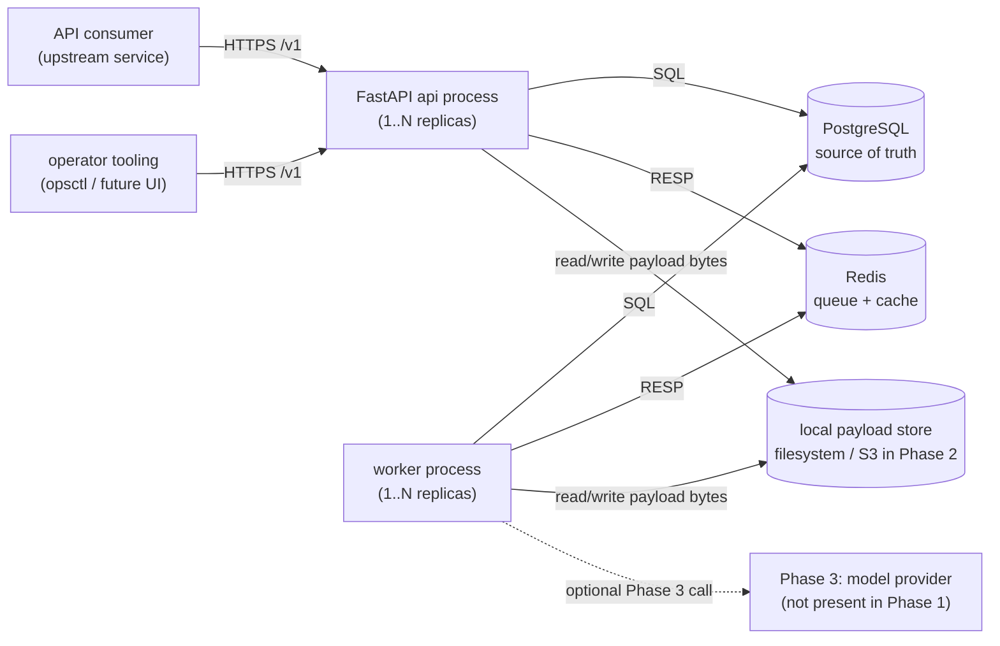
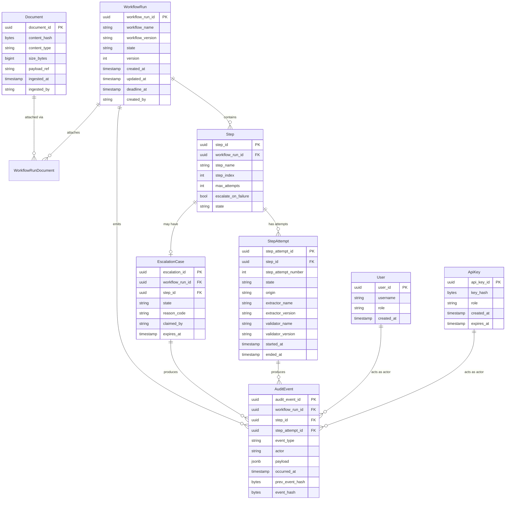
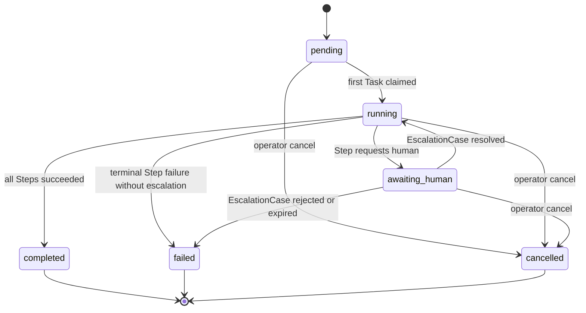
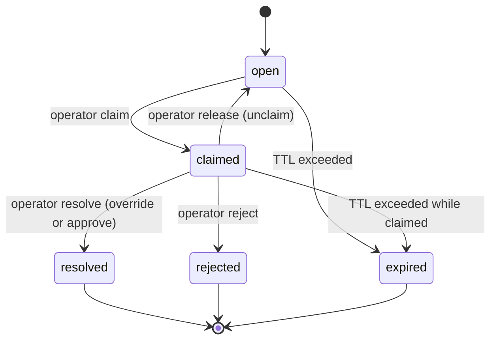
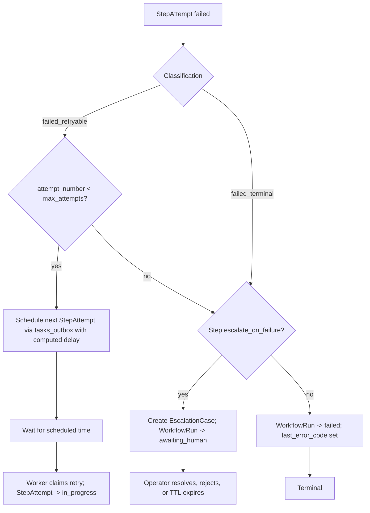

# SYSTEM_ARCHITECTURE.md

## 1. Purpose

This document is the architectural center of Phase 0 for InsuranceOps AI.
It defines every lifecycle, every domain model, every boundary,
and every storage and queue contract the platform will implement in Phase 1 and beyond.
It is the authoritative source that the remaining six operational documents
(SECURITY_REVIEW.md, OBSERVABILITY_STRATEGY.md, TESTING_STRATEGY.md,
DEPLOYMENT_STRATEGY.md, RISK_ANALYSIS.md, TECHNICAL_DEBT_PREVENTION.md)
cross-reference by section number.
When a later document touches a topic owned here,
it states the fact and links back rather than restating the reasoning.

This document is deliberately a single large file.
The architecture is cohesive.
Reading it end-to-end is the fastest path to understanding the system.
Splitting it into a folder of fragments would optimize for browse time
at the cost of comprehension time, which is the wrong tradeoff
for a platform whose correctness depends on the interactions between parts.

If this document contradicts SPEC.md, SPEC.md wins and this document is amended.
If any other Phase 0 document contradicts this one, this document wins
for architecture questions and is amended only through a direct change here.

## 2. Scope

In scope for this document:

- The physical topology of the Phase 1 deployment.
- The proposed repository layout for Phase 1 code (as a plan, not as files).
- The full domain model with invariants and relationships.
- The concrete column-level Postgres schema for every table the platform owns.
- The concrete Redis key surface, including queue structure, locks, rate-limit counters, and idempotency keys.
- The state machine for WorkflowRun, Step, StepAttempt, and EscalationCase.
- The step-level retry and escalation orchestration.
- The ingestion, extraction, validation, routing, and escalation lifecycles end-to-end.
- The AuditEvent model, including the per-run hash chain and the replay procedure.
- The API surface under `/v1` with route-level contracts.
- The observability and security surfaces at an architectural level.
  The full treatment lives in OBSERVABILITY_STRATEGY.md and SECURITY_REVIEW.md.
- Concurrency posture, scaling posture, failure handling, and dependency justification.

Out of scope for this document:

- Runbooks, dashboards, alert rules, SLO targets.
  Those live in OBSERVABILITY_STRATEGY.md and DEPLOYMENT_STRATEGY.md.
- Test-plan-level detail.
  That lives in TESTING_STRATEGY.md.
- Threat enumeration at the per-endpoint level.
  That lives in SECURITY_REVIEW.md.
- Phase 3 AI model integration beyond the Extractor and Validator interfaces.
- Phase 4+ multi-tenant and multi-region concerns, except to acknowledge them as deferred.

## 3. System overview

InsuranceOps AI is a single Python application deployed as a single Docker image.
The image has two process types selected by the container's start command:
an `api` process that serves the FastAPI control plane,
and a `worker` process that consumes Tasks and executes Step handlers.
Both process types share identical code, identical dependencies,
and identical access to the state stores.
The only difference is which entrypoint they run.

Two shared state stores back every process:
PostgreSQL is the transactional source of truth for every durable entity
(Document, WorkflowRun, Step, StepAttempt, EscalationCase, AuditEvent, users, api_keys),
and Redis is the non-durable coordination substrate
(Task queue, in-flight lists, delayed ZSET, locks, rate counters, idempotency tokens).
No other stateful infrastructure is required at Phase 1.

### 3.1 Physical topology (ASCII)

The following ASCII diagram shows every process, every store,
and every trust boundary in the Phase 1 deployment.

```
                                    trust boundary: internal network
        +--------------------+       . . . . . . . . . . . . . . . . . .
        |   API consumer     |  HTTPS .                                 .
        | (upstream service) +--------+                                 .
        +--------------------+       .|                                 .
                                     .v                                 .
        +--------------------+       .+------------------+              .
        |  operator tooling  +--------| FastAPI  api     |              .
        |  (opsctl / future  |  HTTPS | process (1..N)   |              .
        |   operator UI)     |       .+---+----------+---+              .
        +--------------------+       .    |          |                  .
                                     .    | SQL      | RESP             .
                                     .    v          v                  .
                                     . +------+   +-------+             .
                                     . | PG   |   | Redis |             .
                                     . |      |   |       |             .
                                     . +---+--+   +---+---+             .
                                     .     ^          ^                 .
                                     .     | SQL      | RESP            .
                                     .     |          |                 .
                                     . +---+----------+---+             .
                                     . | worker process   |             .
                                     . | (1..N replicas)  |             .
                                     . +--+------------+--+             .
                                     .    |            |                .
                                     .    |            |                .
                                     . . .|. . . . . . |. . . . . . . . .
                                          |            |
                                          v            v
                                    +-----+-----+  +---+----------------+
                                    | local FS  |  | [Phase 3] model    |
                                    | payload   |  | provider boundary  |
                                    | store     |  | (greyed out)       |
                                    +-----------+  +--------------------+
```

Notes on the topology:

- Every external caller reaches the platform through the FastAPI api process.
  No other ingress exists.
- The worker process has no inbound network surface.
  It only makes outbound connections to Postgres, Redis, the local payload store,
  and (at Phase 3) model providers.
- The payload store at Phase 1 is the local container filesystem
  with a mounted volume.
  The `payload_ref` column on Document points to a path inside that volume.
  Phase 2 replaces this with an S3-compatible object store
  behind the same Python interface (see section 9.4).
- The Phase 3 model provider boundary is shown greyed in the diagram
  because no such integration exists at Phase 1.
  The Extractor interface is already designed so that a Phase 3 model provider
  slots in without changing any other part of the system.

### 3.2 Physical topology (mermaid)

The same topology rendered as a mermaid flowchart,
for readers who prefer rendered diagrams:



### 3.3 Component responsibilities

FastAPI api process.
Accepts HTTPS requests under `/v1`, authenticates them via API key,
validates payloads against Pydantic v2 schemas, writes durable state to Postgres,
enqueues Tasks through the outbox pattern (described in section 8),
and returns responses.
The api process does NOT execute Step handlers, does NOT run extraction or validation,
and does NOT interact with the Phase 3 model boundary.
Failure modes it owns: request validation errors, authentication failures,
store unavailability that it reports as 503, and internal server errors.
It never silently drops a request: every request produces either a 2xx, a 4xx, or a 5xx.

Worker process.
Polls Redis for Tasks using the reliable-queue pattern (section 14),
loads the associated WorkflowRun and Step rows from Postgres,
executes the Step handler for the current StepAttempt,
writes the StepAttempt outcome and an AuditEvent inside a single Postgres transaction,
and enqueues the next Task through the outbox.
Failure modes it owns: handler crashes, handler timeouts,
downstream store unavailability, and poison-pill Tasks.
Workers are stateless beyond the Task currently in flight:
losing a worker at any point results at most in a visibility-timeout delay,
never in a lost state transition.

PostgreSQL.
Stores every durable row the platform owns.
Enforces foreign keys, check constraints, unique constraints,
and the append-only property of audit_events via triggers and grants.
Failure mode it owns: unavailability, which both api and worker handle by returning
or pausing with bounded backoff (section 22).

Redis.
Stores Tasks (Lists), delayed Tasks (ZSET), the dead-letter queue (List),
workflow-run-scoped locks (strings with TTL), rate-limit counters (counters with TTL),
and idempotency tokens (strings with TTL).
A full Redis flush is survivable: committed Postgres state is not lost;
the system replays the tasks_outbox drain and resumes work (section 22.5).
Failure mode it owns: unavailability, which api and worker treat as a reason
to pause or return 503, never as a reason to skip a transition.

Local payload store.
Holds raw Document bytes.
Phase 1 uses a mounted volume; Phase 2 uses S3-compatible object storage
behind the same interface.
Failure mode it owns: write failure (rejects ingestion with 5xx),
read failure (StepAttempt fails_retryable and is re-attempted).

Phase 3 model provider boundary.
Not present at Phase 1.
The system's Extractor interface (section 10) is shaped so that
a future model-backed Extractor slots in behind it without changing the rest of the platform.

## 4. Repository structure proposal

This section describes the repository layout that Phase 1 will realize.
No files from this tree are created in Phase 0.
The tree below is a plan, and is referenced by DEPLOYMENT_STRATEGY.md
and TECHNICAL_DEBT_PREVENTION.md when those documents cite a canonical location
(for example "structured logging lives in `src/insuranceops/observability/logging.py`").

```
insuranceops-ai/
  README.md
  .gitignore
  SPEC.md
  PRODUCT_REQUIREMENTS.md
  SYSTEM_ARCHITECTURE.md
  PHASED_ROADMAP.md
  SECURITY_REVIEW.md
  OBSERVABILITY_STRATEGY.md
  TESTING_STRATEGY.md
  DEPLOYMENT_STRATEGY.md
  RISK_ANALYSIS.md
  TECHNICAL_DEBT_PREVENTION.md
  pyproject.toml
  uv.lock
  src/
    insuranceops/
      __init__.py
      config.py
      api/
        __init__.py
        app.py
        deps.py
        routes/
          documents.py
          workflow_runs.py
          escalations.py
          health.py
          metrics.py
        schemas/
          documents.py
          workflow_runs.py
          escalations.py
          errors.py
      workers/
        __init__.py
        main.py
        loop.py
        reaper.py
        scheduler.py
        outbox_relay.py
      workflows/
        __init__.py
        registry.py
        definitions/
          claim_intake_v1.py
      domain/
        __init__.py
        documents.py
        workflow_runs.py
        steps.py
        step_attempts.py
        escalations.py
        audit.py
        actors.py
      storage/
        __init__.py
        db.py
        models.py
        repositories/
          documents.py
          workflow_runs.py
          steps.py
          step_attempts.py
          escalations.py
          audit.py
          outbox.py
        payloads/
          __init__.py
          local.py
          s3.py
      queue/
        __init__.py
        redis_client.py
        reliable_queue.py
        delayed_queue.py
        dlq.py
      audit/
        __init__.py
        chain.py
        verifier.py
      observability/
        __init__.py
        logging.py
        metrics.py
        tracing.py
      security/
        __init__.py
        auth.py
        rbac.py
        redaction.py
        encryption.py
  migrations/
    alembic.ini
    env.py
    versions/
      0001_initial.py
  tests/
    __init__.py
    conftest.py
    unit/
      test_domain_invariants.py
      test_retry_policy.py
      test_audit_chain.py
    integration/
      test_api_documents.py
      test_api_workflow_runs.py
      test_api_escalations.py
      test_queue_reliability.py
    workflow/
      test_claim_intake_v1_happy_path.py
      test_claim_intake_v1_retries.py
      test_claim_intake_v1_escalation.py
      test_replay_determinism.py
    fixtures/
      documents/
      workflow_runs/
  compose/
    compose.yml
    compose.test.yml
  docker/
    Dockerfile
  scripts/
    dev_up.sh
    dev_down.sh
    opsctl
    seed_dev_data.py
  .github/
    workflows/
      ci.yml
```

Top-level folder responsibilities:

- `src/insuranceops/api/` holds the FastAPI app, dependency injection hooks,
  route modules, and Pydantic schemas for request and response.
  No business logic lives here; routes delegate to the domain layer.
- `src/insuranceops/workers/` holds the worker entrypoint, the main processing loop,
  the reaper loop, the delayed-queue scheduler loop, and the outbox relay loop.
  Each loop is a separately-startable coroutine or process for testability.
- `src/insuranceops/workflows/` holds the Workflow registry
  and the per-Workflow definition modules.
  A Workflow is a Python module with a declarative list of Steps and policies.
- `src/insuranceops/domain/` holds the pure-Python domain logic:
  invariants, state transitions, validation rules, routing computation.
  Functions here take plain dataclasses and return plain dataclasses.
  No I/O, no framework imports.
- `src/insuranceops/storage/` holds database access:
  connection pool setup, SQLAlchemy models for domain tables,
  explicit SQL for hot-path audit and outbox tables,
  repository classes that bridge the domain layer and the database.
  Also holds the payload store adapters (local, s3).
- `src/insuranceops/queue/` holds the Redis client setup, the reliable-queue primitives,
  the delayed-queue primitives, and DLQ operations.
- `src/insuranceops/audit/` holds the hash-chain computation and the verifier.
- `src/insuranceops/observability/` holds structlog configuration,
  Prometheus metric definitions, and the OTel-ready tracing wrapper.
- `src/insuranceops/security/` holds API-key auth, RBAC dependency,
  log-time PII redaction, and column-level encryption helpers.
- `migrations/` holds Alembic configuration and migration scripts.
- `tests/unit/` covers pure-Python units with no I/O.
  `tests/integration/` covers API and storage with real Postgres and Redis
  via service containers.
  `tests/workflow/` covers end-to-end workflow runs including replay determinism.
  `tests/fixtures/` holds sample Documents and canned WorkflowRun states.
- `compose/` holds the Compose definitions for local development and tests.
  `docker/` holds the Dockerfile that produces the single shared image.
  `scripts/` holds developer utilities.
- `.github/workflows/` holds CI workflow files.

None of these files exist in Phase 0.
The tree above is the target realized in Phase 1.
FEAT items in Phase 1 will create the actual files.

## 5. Domain model

This section defines every canonical entity by its invariants and its relationships.
The canonical names are exactly as spelled in SPEC.md's glossary and in
`context.json > architectural_decisions > domain_entities_canonical_names`.
No alternate spellings are allowed.
The nine entities are: Document, Workflow, WorkflowRun, Step, StepAttempt,
Task, EscalationCase, AuditEvent, and Actor.

### 5.1 Document

A Document is a single uploaded artifact,
identified by `document_id` (UUID v4).
Documents are immutable once ingested:
the payload bytes, the content hash, the content type, and the size
do not change for the life of the row.

Invariants:

- `document_id` is unique across the platform.
- `content_hash` is the SHA-256 of the exact payload bytes stored.
  Two Documents may share a `content_hash` if the same bytes are submitted twice
  with different Actors or different idempotency keys;
  the ingestion endpoint treats content-hash collisions
  as idempotent returns for the same (api_key, idempotency_key) scope.
- `payload_ref` is the opaque storage key (filesystem path or object key)
  for the bytes in the payload store.
  The bytes must be retrievable by that reference for the retention window.
- Deleting a Document row is forbidden by application policy and by grants.
  Payload retirement removes the bytes but leaves the row.

References:
A Document is referenced by zero or more WorkflowRuns
through the `workflow_run_documents` association.
A Document is referenced by zero or more AuditEvents through `payload.document_id`.

### 5.2 Workflow

A Workflow is a named, versioned definition in code.
It is identified by the pair (`workflow_name`, `workflow_version`).
Workflows do not have a database row:
they are Python modules registered at process startup.

Invariants:

- `(workflow_name, workflow_version)` is unique in the registry.
- A Workflow declares an ordered list of Step definitions,
  each with `step_name`, `max_attempts`, `escalate_on_failure`, and an optional per-step timeout.
- Bumping `workflow_version` is a code change reviewed like any other.
- In-flight WorkflowRuns continue to execute under the version they started with.
  A running WorkflowRun never silently migrates to a newer Workflow version.

References:
A Workflow is referenced by WorkflowRuns through
`workflow_runs.workflow_name` and `workflow_runs.workflow_version`.

### 5.3 WorkflowRun

A WorkflowRun is a single execution of a Workflow against one or more Documents.
Identified by `workflow_run_id` (UUID v4).
Has a deterministic state machine:
`pending`, `running`, `awaiting_human`, `completed`, `failed`, `cancelled`.

Invariants:

- Exactly one state is current at any time.
- Only legal transitions are permitted (section 8).
  An attempted illegal transition raises an exception and emits no AuditEvent.
- `version` column is incremented on every state change.
  Updates use optimistic locking on `version`;
  a mismatch triggers a retry of the transition pipeline on the caller side.
- A WorkflowRun that reaches `completed`, `failed`, or `cancelled` never transitions again.
  Attempting to do so is an application error.
- Every state change produces exactly one AuditEvent with matching
  `workflow_run_id` and matching `occurred_at`.

References:
A WorkflowRun has many Steps.
A WorkflowRun has many AuditEvents.
A WorkflowRun has zero or more Documents through the association table.

### 5.4 Step

A Step is a unit of work inside a WorkflowRun.
Identified by `step_id` (UUID v4) and by a stable `step_name` within the run.

Invariants:

- `(workflow_run_id, step_index)` is unique.
- `(workflow_run_id, step_name)` is unique:
  a Workflow definition never declares the same `step_name` twice in a run.
- A Step has at least one StepAttempt once it begins.
  A Step with no StepAttempts is still `queued`.
- A Step's terminal state is determined by the outcome of its final StepAttempt.

References:
A Step belongs to one WorkflowRun.
A Step has many StepAttempts.
A Step has zero or one EscalationCase.

### 5.5 StepAttempt

A StepAttempt is one try of a Step.
Identified by `step_attempt_id` (UUID v4)
with a `step_attempt_number` starting at 1 and incrementing monotonically per Step.

Invariants:

- `(step_id, step_attempt_number)` is unique.
- State is one of `queued`, `in_progress`, `succeeded`,
  `failed_retryable`, `failed_terminal`, or `skipped`.
- The StepAttempt row carries the `extractor_name`, `extractor_version`,
  `validator_name`, `validator_version` (nullable per step type)
  that were used during this attempt,
  so a replay can re-execute with the same code.
- Handler code is idempotent keyed on `(workflow_run_id, step_name, step_attempt_number)`.
  Re-execution at the same key returns the same outcome.

References:
A StepAttempt belongs to one Step.
A StepAttempt is referenced by at most one AuditEvent
as the subject of `step_attempt_started`, `step_attempt_succeeded`,
`step_attempt_failed_retryable`, or `step_attempt_failed_terminal`.

### 5.6 Task

A Task is a queue message pointing at a (WorkflowRun, Step, StepAttempt) triple.
Tasks live in Redis Lists and in `queue:tasks:delayed` ZSET.
Tasks do not have a Postgres row of their own;
the durable representation is the `tasks_outbox` row that preceded enqueue.

Invariants:

- A Task payload is JSON-encoded and contains at minimum
  `workflow_run_id`, `step_id`, `step_attempt_id`, `enqueued_at`, `correlation_id`.
- A Task is ACKed by removing it from its per-worker inflight list.
  The ACK is idempotent:
  removing an absent item is not an error.
- A Task in `queue:tasks:delayed` becomes eligible at its scheduled timestamp,
  not before.

References:
A Task references one WorkflowRun, one Step, and one StepAttempt.

### 5.7 EscalationCase

An EscalationCase is a human-in-the-loop work item.
Identified by `escalation_id` (UUID v4).
States: `open`, `claimed`, `resolved`, `rejected`, `expired`.

Invariants:

- `(workflow_run_id, step_id)` is unique:
  a Step has at most one EscalationCase across the life of the WorkflowRun.
- Claim is an atomic conditional update:
  `UPDATE escalation_cases SET state='claimed', claimed_by=:actor WHERE state='open' AND ...`
  returning the number of rows changed.
  Zero rows changed means another operator won the race;
  the API returns 409 Conflict.
- Resolving or rejecting an EscalationCase resumes the parent WorkflowRun
  from the escalated Step with a synthetic StepAttempt
  (`origin='human'`, carrying the operator's override or decision payload).
- Expired cases transition the WorkflowRun to `failed`
  unless the Step is configured `retry_on_expiration` (rare, documented per workflow).

References:
An EscalationCase belongs to one Step, which belongs to one WorkflowRun.
An EscalationCase is referenced by AuditEvents of types
`escalation_created`, `escalation_claimed`, `escalation_resolved`,
`escalation_rejected`, `escalation_expired`.

### 5.8 AuditEvent

An AuditEvent is an append-only record of a state transition or human action.
Identified by `audit_event_id` (UUID v7 for time-sortable keys).

Invariants:

- `audit_events` rows are never updated or deleted.
  This is enforced by grants: the application role has INSERT and SELECT only.
- Every AuditEvent belongs to a WorkflowRun via `workflow_run_id`.
- AuditEvents are hash-chained per `workflow_run_id`:
  each event stores `prev_event_hash`
  (the SHA-256 of the previous AuditEvent row's `event_hash` for the same run,
  or NULL for the first event of the run).
- `event_hash` is deterministic over the row's content
  (all columns except `event_hash` itself).
- Replay of the log rebuilds the final state of the run;
  any mismatch with the stored WorkflowRun row is a high-severity alert.

References:
An AuditEvent references one WorkflowRun, optionally one Step,
optionally one StepAttempt, and exactly one Actor.

### 5.9 Actor

An Actor is the principal that caused an event.
Actors are not a standalone table:
the `actor` column on `audit_events` is a string of the form `<kind>:<subkind>:<id>`.
Human users are rows in the `users` table;
their Actor string is `user:<role>:<user_id>`.
Service identities are conventions; their Actor string is
`api:control_plane`, `worker:main`, `worker:reaper`,
`worker:scheduler`, or `worker:outbox_relay`.

Invariants:

- Every AuditEvent has a non-null `actor`.
- Every write-bearing API request records the Actor in its emitted AuditEvents.
- Service-identity Actors are a closed set defined in code and documented here.

### 5.10 Entity relationship diagram

The following mermaid ER diagram renders the relationships described above.
Cardinalities use the crow's-foot notation supported by mermaid's `erDiagram`.



The association `WorkflowRunDocument` is a thin table
(`workflow_run_id`, `document_id`, `attached_at`, primary key on the pair)
that lets a Document be attached to a WorkflowRun at or after ingestion.
It is included here for completeness;
its full schema appears in section 6 as part of the platform's Postgres surface.

## 6. Storage schema (PostgreSQL)

PostgreSQL is the source of truth for every durable entity.
This section specifies every column of every table,
the intended index set per table,
the partitioning and retention policy per table,
and the discipline around migrations.

Types use Postgres canonical names (`uuid`, `text`, `bytea`, `timestamptz`, `jsonb`,
`bigint`, `integer`, `smallint`, `boolean`).
Primary keys are explicit.
Foreign keys name the referenced column.
Check constraints are shown where the column has a constrained domain.

### 6.1 `documents`

One row per ingested Document.

| Column         | Type         | Constraints                                          | Notes                                                                  |
|----------------|--------------|------------------------------------------------------|------------------------------------------------------------------------|
| document_id    | uuid         | PRIMARY KEY                                          | UUID v4 assigned at ingest.                                            |
| content_hash   | bytea        | NOT NULL, CHECK (octet_length(content_hash) = 32)    | SHA-256 of the raw payload bytes.                                      |
| content_type   | text         | NOT NULL, CHECK (content_type ~ '^[a-z0-9.+-]+/[a-z0-9.+-]+$') | IANA media type.                                              |
| size_bytes     | bigint       | NOT NULL, CHECK (size_bytes >= 0)                    | Size of the payload in bytes.                                          |
| payload_ref    | text         | NOT NULL                                             | Opaque storage key (filesystem path or S3 key).                        |
| ingested_at    | timestamptz  | NOT NULL, DEFAULT now()                              | UTC timestamp of ingestion.                                            |
| ingested_by    | text         | NOT NULL                                             | Actor string that caused the ingest.                                   |
| idempotency_key| text         | NULL                                                 | Client-provided Idempotency-Key header, scoped to api_key_id.           |
| api_key_id     | uuid         | NULL, REFERENCES api_keys(api_key_id)                | API key that ingested the Document, when the request was key-authenticated. |
| metadata       | jsonb        | NOT NULL, DEFAULT '{}'::jsonb                        | Extracted metadata (mimetype detail, page count for PDFs, and similar). |

### 6.2 `workflow_runs`

One row per WorkflowRun.

| Column            | Type         | Constraints                                                                                                                 | Notes                                                                 |
|-------------------|--------------|-----------------------------------------------------------------------------------------------------------------------------|-----------------------------------------------------------------------|
| workflow_run_id   | uuid         | PRIMARY KEY                                                                                                                 | UUID v4 assigned at creation.                                         |
| workflow_name     | text         | NOT NULL                                                                                                                    | Stable snake_case name.                                               |
| workflow_version  | text         | NOT NULL                                                                                                                    | Version string set at run creation.                                   |
| state             | text         | NOT NULL, CHECK (state IN ('pending','running','awaiting_human','completed','failed','cancelled'))                          | Current state.                                                        |
| version           | bigint       | NOT NULL, DEFAULT 0                                                                                                         | Optimistic-lock column; incremented on every update.                  |
| current_step_id   | uuid         | NULL, REFERENCES steps(step_id)                                                                                             | Cursor into `steps`. NULL before first step, NULL after terminal.     |
| created_at        | timestamptz  | NOT NULL, DEFAULT now()                                                                                                     | UTC timestamp of creation.                                            |
| updated_at        | timestamptz  | NOT NULL, DEFAULT now()                                                                                                     | Last row update timestamp; maintained by application.                 |
| deadline_at       | timestamptz  | NOT NULL                                                                                                                    | Absolute deadline; reaper transitions to failed if exceeded.          |
| created_by        | text         | NOT NULL                                                                                                                    | Actor string that created the run.                                    |
| last_error_code   | text         | NULL                                                                                                                        | Populated on transitions to `failed`.                                  |
| last_error_detail | text         | NULL                                                                                                                        | Human-readable detail for the most recent terminal failure.           |

An association table maps runs to documents:

| Column         | Type        | Constraints                                     | Notes                                  |
|----------------|-------------|-------------------------------------------------|----------------------------------------|
| workflow_run_id| uuid        | NOT NULL, REFERENCES workflow_runs(workflow_run_id) | Part of composite PRIMARY KEY.     |
| document_id    | uuid        | NOT NULL, REFERENCES documents(document_id)     | Part of composite PRIMARY KEY.         |
| attached_at    | timestamptz | NOT NULL, DEFAULT now()                         | UTC timestamp of attachment.           |

### 6.3 `steps`

One row per Step within a WorkflowRun.

| Column              | Type         | Constraints                                                                                                                                 | Notes                                                                |
|---------------------|--------------|---------------------------------------------------------------------------------------------------------------------------------------------|----------------------------------------------------------------------|
| step_id             | uuid         | PRIMARY KEY                                                                                                                                 | UUID v4 assigned at run creation.                                    |
| workflow_run_id     | uuid         | NOT NULL, REFERENCES workflow_runs(workflow_run_id) ON DELETE RESTRICT                                                                      | Owning run.                                                          |
| step_name           | text         | NOT NULL                                                                                                                                    | Canonical step name per the Workflow definition.                     |
| step_index          | integer      | NOT NULL, CHECK (step_index >= 0)                                                                                                           | Position of this Step in the Workflow.                               |
| state               | text         | NOT NULL, CHECK (state IN ('queued','in_progress','succeeded','failed_retryable','failed_terminal','skipped'))                              | Mirrors the final StepAttempt's state once the Step is done.         |
| max_attempts        | smallint     | NOT NULL, CHECK (max_attempts >= 1 AND max_attempts <= 10)                                                                                  | Per-Step retry cap.                                                  |
| escalate_on_failure | boolean      | NOT NULL, DEFAULT false                                                                                                                     | If true, terminal failure creates an EscalationCase.                 |
| retry_policy        | jsonb        | NOT NULL, DEFAULT '{"base_delay_s":2,"cap_s":60,"jitter":"full"}'::jsonb                                                                    | Per-Step retry policy override.                                      |
| created_at          | timestamptz  | NOT NULL, DEFAULT now()                                                                                                                     | Row creation.                                                        |
| started_at          | timestamptz  | NULL                                                                                                                                        | Set when the first StepAttempt starts.                               |
| ended_at            | timestamptz  | NULL                                                                                                                                        | Set when the Step reaches a terminal state.                          |

Uniqueness:

- `UNIQUE (workflow_run_id, step_index)`
- `UNIQUE (workflow_run_id, step_name)`

### 6.4 `step_attempts`

One row per StepAttempt.

| Column                | Type         | Constraints                                                                                                                                             | Notes                                                              |
|-----------------------|--------------|---------------------------------------------------------------------------------------------------------------------------------------------------------|--------------------------------------------------------------------|
| step_attempt_id       | uuid         | PRIMARY KEY                                                                                                                                             | UUID v4.                                                           |
| step_id               | uuid         | NOT NULL, REFERENCES steps(step_id) ON DELETE RESTRICT                                                                                                  | Parent Step.                                                       |
| step_attempt_number   | smallint     | NOT NULL, CHECK (step_attempt_number >= 1)                                                                                                              | 1-based counter per Step.                                          |
| state                 | text         | NOT NULL, CHECK (state IN ('queued','in_progress','succeeded','failed_retryable','failed_terminal','skipped'))                                          | StepAttempt state.                                                 |
| origin                | text         | NOT NULL, DEFAULT 'system', CHECK (origin IN ('system','human','reaper','replay'))                                                                      | Who initiated this attempt.                                        |
| extractor_name        | text         | NULL                                                                                                                                                    | Extractor implementation name for extraction steps.                |
| extractor_version     | text         | NULL                                                                                                                                                    | Extractor implementation version.                                  |
| validator_name        | text         | NULL                                                                                                                                                    | Validator implementation name for validation steps.                |
| validator_version     | text         | NULL                                                                                                                                                    | Validator implementation version.                                  |
| input_ref             | text         | NULL                                                                                                                                                    | Optional reference to the input snapshot for replay.               |
| output_ref            | text         | NULL                                                                                                                                                    | Optional reference to the output snapshot (for example a validation result blob). |
| error_code            | text         | NULL                                                                                                                                                    | Populated for failures.                                            |
| error_detail          | text         | NULL                                                                                                                                                    | Human-readable failure detail.                                     |
| started_at            | timestamptz  | NULL                                                                                                                                                    | Set when the worker claims the Task.                               |
| ended_at              | timestamptz  | NULL                                                                                                                                                    | Set on terminal transition.                                        |
| scheduled_for         | timestamptz  | NULL                                                                                                                                                    | Set when the attempt is delayed (retry backoff).                   |
| created_at            | timestamptz  | NOT NULL, DEFAULT now()                                                                                                                                 | Row creation.                                                      |

Uniqueness:

- `UNIQUE (step_id, step_attempt_number)`

### 6.5 `tasks_outbox`

One row per Task that must be enqueued into Redis.
The outbox is the transactional bridge between Postgres and Redis (section 8.4).

| Column            | Type         | Constraints                                                                                                           | Notes                                                                              |
|-------------------|--------------|-----------------------------------------------------------------------------------------------------------------------|------------------------------------------------------------------------------------|
| outbox_id         | bigserial    | PRIMARY KEY                                                                                                           | Ordering key for the drain loop.                                                   |
| workflow_run_id   | uuid         | NOT NULL, REFERENCES workflow_runs(workflow_run_id)                                                                   | Scope for the Task.                                                                |
| step_id           | uuid         | NOT NULL, REFERENCES steps(step_id)                                                                                   | Step the Task targets.                                                             |
| step_attempt_id   | uuid         | NOT NULL, REFERENCES step_attempts(step_attempt_id)                                                                   | StepAttempt the Task targets.                                                      |
| payload           | jsonb        | NOT NULL                                                                                                              | Task payload JSON, identical to what the worker will pop from Redis.               |
| scheduled_for     | timestamptz  | NOT NULL, DEFAULT now()                                                                                               | When the Task becomes eligible; future values go into `queue:tasks:delayed`.       |
| enqueued_at       | timestamptz  | NULL                                                                                                                  | Set by the outbox relay once the Task lands in Redis.                              |
| attempts          | smallint     | NOT NULL, DEFAULT 0, CHECK (attempts >= 0 AND attempts <= 10)                                                         | Outbox-relay retries; distinct from StepAttempt retries.                           |
| last_error        | text         | NULL                                                                                                                  | Most recent relay failure detail.                                                  |
| created_at        | timestamptz  | NOT NULL, DEFAULT now()                                                                                               | Row creation.                                                                      |

Rows are deleted after a successful relay once they are older than the outbox TTL
(default 7 days) by a background maintenance job.

### 6.6 `escalation_cases`

One row per EscalationCase.

| Column            | Type         | Constraints                                                                                                         | Notes                                                          |
|-------------------|--------------|---------------------------------------------------------------------------------------------------------------------|----------------------------------------------------------------|
| escalation_id     | uuid         | PRIMARY KEY                                                                                                         | UUID v4.                                                       |
| workflow_run_id   | uuid         | NOT NULL, REFERENCES workflow_runs(workflow_run_id)                                                                 | Parent run.                                                    |
| step_id           | uuid         | NOT NULL, REFERENCES steps(step_id)                                                                                 | Step that escalated.                                           |
| state             | text         | NOT NULL, CHECK (state IN ('open','claimed','resolved','rejected','expired'))                                       | EscalationCase state.                                          |
| reason_code       | text         | NOT NULL                                                                                                            | Structured reason (for example `extractor_confidence_below_threshold`). |
| reason_detail     | text         | NULL                                                                                                                | Human-readable detail shown in the operator UI.                |
| claimed_by        | text         | NULL                                                                                                                | Actor that claimed the case.                                   |
| claimed_at        | timestamptz  | NULL                                                                                                                | Timestamp of claim.                                            |
| resolved_by       | text         | NULL                                                                                                                | Actor that resolved or rejected.                               |
| resolved_at       | timestamptz  | NULL                                                                                                                | Timestamp of resolution.                                       |
| resolution_payload| jsonb        | NULL                                                                                                                | Operator override payload when resolving.                      |
| expires_at        | timestamptz  | NOT NULL                                                                                                            | Wall-clock deadline; reaper expires past this.                 |
| created_at        | timestamptz  | NOT NULL, DEFAULT now()                                                                                             | Row creation.                                                  |

Uniqueness:

- `UNIQUE (workflow_run_id, step_id)` reflects the invariant that a Step has at most one EscalationCase.

### 6.7 `audit_events`

One row per AuditEvent.
This table is append-only.
Grants on the application role are INSERT and SELECT only;
UPDATE and DELETE are revoked and enforced at the role level.

| Column              | Type         | Constraints                                                                                                                   | Notes                                                              |
|---------------------|--------------|-------------------------------------------------------------------------------------------------------------------------------|--------------------------------------------------------------------|
| audit_event_id      | uuid         | PRIMARY KEY                                                                                                                   | UUID v7, time-sortable.                                            |
| workflow_run_id     | uuid         | NOT NULL, REFERENCES workflow_runs(workflow_run_id)                                                                           | Run this event belongs to.                                         |
| step_id             | uuid         | NULL, REFERENCES steps(step_id)                                                                                               | Step subject when applicable.                                      |
| step_attempt_id     | uuid         | NULL, REFERENCES step_attempts(step_attempt_id)                                                                               | StepAttempt subject when applicable.                               |
| event_type          | text         | NOT NULL                                                                                                                      | Canonical event type string.                                       |
| actor               | text         | NOT NULL                                                                                                                      | Actor string (`user:...`, `api:...`, `worker:...`).                |
| payload             | jsonb        | NOT NULL, DEFAULT '{}'::jsonb                                                                                                 | Event-type-specific payload.                                       |
| occurred_at         | timestamptz  | NOT NULL, DEFAULT now()                                                                                                       | UTC timestamp of emission.                                         |
| seq_in_run          | bigint       | NOT NULL                                                                                                                      | Monotonically increasing sequence within `workflow_run_id`.        |
| prev_event_hash     | bytea        | NULL, CHECK (prev_event_hash IS NULL OR octet_length(prev_event_hash) = 32)                                                   | SHA-256 of the previous AuditEvent's `event_hash` in the same run. |
| event_hash          | bytea        | NOT NULL, CHECK (octet_length(event_hash) = 32)                                                                               | SHA-256 over the row content excluding `event_hash`.               |

Uniqueness:

- `UNIQUE (workflow_run_id, seq_in_run)` guarantees ordered replay.

### 6.8 `api_keys`

One row per machine-client API key.

| Column        | Type         | Constraints                                                                                           | Notes                                                       |
|---------------|--------------|-------------------------------------------------------------------------------------------------------|-------------------------------------------------------------|
| api_key_id    | uuid         | PRIMARY KEY                                                                                           | UUID v4.                                                    |
| key_hash      | bytea        | NOT NULL, UNIQUE, CHECK (octet_length(key_hash) = 32)                                                 | SHA-256 of the opaque key; only the hash is stored.         |
| label         | text         | NOT NULL                                                                                              | Human-readable label for the key.                           |
| role          | text         | NOT NULL, CHECK (role IN ('operator','supervisor','viewer'))                                          | Role assigned to the key.                                   |
| created_at    | timestamptz  | NOT NULL, DEFAULT now()                                                                               | Row creation.                                               |
| created_by    | text         | NOT NULL                                                                                              | Actor that created the key.                                 |
| expires_at    | timestamptz  | NULL                                                                                                  | Optional expiration.                                        |
| revoked_at    | timestamptz  | NULL                                                                                                  | Set on revocation; auth fails if set.                       |
| last_used_at  | timestamptz  | NULL                                                                                                  | Updated asynchronously on successful auth.                  |

### 6.9 `users`

One row per human user of the operator surface.

| Column        | Type         | Constraints                                                                                           | Notes                                                       |
|---------------|--------------|-------------------------------------------------------------------------------------------------------|-------------------------------------------------------------|
| user_id       | uuid         | PRIMARY KEY                                                                                           | UUID v4.                                                    |
| username      | text         | NOT NULL, UNIQUE                                                                                      | Stable operator username.                                   |
| display_name  | text         | NOT NULL                                                                                              | Human-readable name for the operator UI.                    |
| role          | text         | NOT NULL, CHECK (role IN ('operator','supervisor','viewer'))                                          | Role assigned.                                              |
| password_hash | bytea        | NULL                                                                                                  | Populated only when password login is enabled (Phase 3).    |
| created_at    | timestamptz  | NOT NULL, DEFAULT now()                                                                               | Row creation.                                               |
| disabled_at   | timestamptz  | NULL                                                                                                  | Set on disable; auth fails if set.                          |
| last_login_at | timestamptz  | NULL                                                                                                  | Updated on successful session creation.                     |

### 6.10 Indexes

Each index is named explicitly and carries a one-line justification.
Index names follow the pattern `idx_<table>_<columns>` or `uq_<table>_<columns>` for unique.
Indexes implied by PRIMARY KEY and UNIQUE constraints are not repeated here.

- `idx_documents_content_hash ON documents(content_hash)` for dedup lookups during ingestion.
- `idx_documents_ingested_at ON documents(ingested_at DESC)` for recent-ingest list views.
- `idx_workflow_runs_state_updated ON workflow_runs(state, updated_at DESC)` for operator queue and reaper scans.
- `idx_workflow_runs_deadline ON workflow_runs(deadline_at) WHERE state IN ('pending','running','awaiting_human')` for the deadline reaper.
- `idx_workflow_runs_created_by ON workflow_runs(created_by, created_at DESC)` for per-Actor run lookups.
- `idx_steps_run ON steps(workflow_run_id, step_index)` for per-run timeline ordering.
- `idx_step_attempts_run_step ON step_attempts(step_id, step_attempt_number DESC)` for attempt history per Step.
- `idx_step_attempts_state_scheduled ON step_attempts(state, scheduled_for) WHERE state = 'queued'` for the scheduler loop.
- `idx_tasks_outbox_undelivered ON tasks_outbox(enqueued_at NULLS FIRST, scheduled_for)` for the outbox relay.
- `idx_escalation_cases_state_expires ON escalation_cases(state, expires_at) WHERE state IN ('open','claimed')` for the expiration reaper.
- `idx_escalation_cases_queue ON escalation_cases(state, created_at) WHERE state = 'open'` for the operator queue listing.
- `idx_audit_events_run_seq ON audit_events(workflow_run_id, seq_in_run)` for ordered replay.
- `idx_audit_events_type_occurred ON audit_events(event_type, occurred_at DESC)` for event-type slicing in investigations.
- `idx_audit_events_actor ON audit_events(actor, occurred_at DESC)` for per-Actor audit trails.
- `idx_api_keys_role_active ON api_keys(role) WHERE revoked_at IS NULL` for auth path lookups.
- `idx_users_role_active ON users(role) WHERE disabled_at IS NULL` for role-based listings.

### 6.11 Partitioning and retention

`audit_events` is the table with the highest expected row volume at scale.
In Phase 1, `audit_events` is a single unpartitioned table.
In Phase 2, `audit_events` is converted to a native Postgres range-partitioned table
partitioned monthly on `occurred_at`.
The partitioning migration is an expand-migrate-contract operation:
create the partitioned parent, attach a new partition for the next month,
backfill a trailing window into matching partitions,
swap reads over, and retire the old single table.
The Phase 2 migration is a scheduled piece of work and is documented here
so later readers know that Phase 1's single table is intentional and bounded.

Retention:

- `documents.payload_ref` bytes are retained for the duration of the Document retention window
  (default 2 years from `ingested_at`).
  The Document row itself is retained for 7 years to preserve referential integrity with audit_events.
  Payload retirement is a background maintenance job;
  it leaves the Document row intact and sets `payload_ref` to a tombstone value.
- `workflow_runs`, `steps`, `step_attempts`, `escalation_cases`:
  retained for 7 years from `created_at`.
  No deletes during retention.
- `audit_events`: retained for 7 years from `occurred_at`.
  Beyond retention, the monthly partition is dropped as a unit.
- `tasks_outbox`: retained for 7 days after successful enqueue.
  Background maintenance drops aged rows.
- `api_keys`: retained indefinitely with `revoked_at` set;
  the row is never deleted to preserve audit linkage to events it caused.
- `users`: retained indefinitely with `disabled_at` set;
  same reasoning as api_keys.

Retention windows above are defaults.
They are configurable per deployment and are documented operationally
in DEPLOYMENT_STRATEGY.md.

### 6.12 Migrations discipline

Alembic manages schema evolution.
The migration discipline is:

- Every schema change goes through a hand-written Alembic revision.
  Autogenerate output is a starting point; the output is always inspected,
  trimmed, and rewritten before commit.
  Autogenerate output is never committed verbatim.
- Migrations are forward-only in production.
  A `downgrade()` function exists for local development ergonomics only
  and is not relied on in production.
  Rolling back a deployment is done by code rollback plus a targeted forward fix, not by downgrade.
- Additive changes are strongly preferred.
  Add a nullable column, backfill, then tighten constraints in a later migration.
  Never drop a column and add a replacement in the same migration.
- Destructive changes (column drop, column type change, table drop) follow expand-migrate-contract:
  add the new shape alongside the old, migrate writers and readers to the new shape,
  verify, then drop the old shape in a separate migration.
  Each phase is a separately-reviewed deploy.
- Every migration has a corresponding test in `tests/integration/migrations/`
  that applies the migration against a fresh Postgres and asserts the shape.
- Data migrations (not pure DDL) run as idempotent batches that can be safely re-run.
  No data migration assumes it will only execute once.
- The first migration (`0001_initial.py`) creates every table listed in this section
  with the indexes listed above, the grants documented here,
  and the check constraints as written.
  There is no "create everything from SQLAlchemy metadata" shortcut in production.

## 7. Storage schema (Redis)

Redis is cache plus queue.
It is never the source of truth.
A full Redis flush is survivable:
committed Postgres state is intact,
the outbox relay re-enqueues in-flight Tasks once Redis is healthy,
in-progress StepAttempts are reaped back into the queue after the visibility timeout,
and the system resumes work with at most a processing delay.
No committed state is lost.

This section enumerates every Redis key pattern the platform uses at Phase 1 and 2.
For each key: type, TTL policy, who writes, who reads, eviction behavior.
Key names use colon-separated segments and are lowercase.

### 7.1 `queue:tasks:ready`

- Type: List.
- Contents: JSON-encoded Task payloads.
- TTL: none (list is persistent).
- Writers: outbox relay (via LPUSH).
- Readers: worker main loop (via BRPOPLPUSH into a per-worker inflight list).
- Eviction: never evicted by Redis; only removed by the worker claiming the Task.

### 7.2 `queue:tasks:inflight:<worker_id>`

- Type: List.
- Contents: Task payloads currently being processed by worker `<worker_id>`.
- TTL: none on the list itself.
  A per-Task visibility timeout is tracked on the payload via a `claimed_at` field;
  the reaper compares that to wall-clock and reclaims stale entries.
- Writers: worker main loop (via BRPOPLPUSH destination).
  Worker removes on ACK (via LREM).
  Reaper removes on reclaim (via LREM).
- Readers: reaper loop (via LRANGE).
- Eviction: never evicted by Redis;
  a Redis flush simply empties the inflight list, and the next StepAttempt
  still has its `queued` row in Postgres and will be re-enqueued by the outbox relay
  after the StepAttempt is reset by the scheduler.

### 7.3 `queue:tasks:delayed`

- Type: Sorted Set (ZSET).
- Members: Task payloads; score is the Unix epoch second at which the Task is eligible.
- TTL: none on the set.
- Writers: outbox relay when `scheduled_for` is in the future.
  Worker main loop when a failed_retryable StepAttempt schedules a retry.
- Readers: scheduler loop (via ZRANGEBYSCORE with `now()` as upper bound)
  which LMOVEs matured entries into `queue:tasks:ready`.
- Eviction: never evicted by Redis.

### 7.4 `queue:tasks:dlq`

- Type: List.
- Contents: Task payloads that exceeded `max_attempts`.
- TTL: none.
- Writers: worker main loop and reaper when a StepAttempt transitions to `failed_terminal`
  due to attempt exhaustion.
- Readers: operator tooling via the DLQ inspection endpoint (Phase 2).
- Eviction: never by Redis.
  Operator explicitly drains or re-enqueues with the Phase 2 DLQ endpoint.

### 7.5 `lock:workflow_run:<workflow_run_id>`

- Type: String.
- Contents: a random token (the lock owner's identity).
- TTL: 30 seconds by default, renewed while work is ongoing.
- Writers: api or worker that needs exclusive access to a WorkflowRun for a short critical section.
  Set via `SET key value NX PX 30000`.
- Readers: same writer, to confirm ownership before critical section work.
- Eviction: TTL-expiry; if a holder crashes, the lock releases naturally.
- Use cases: the narrow single-writer-per-run paths that cannot be expressed purely
  through optimistic locking on `workflow_runs.version`.
  For most updates, the `version` optimistic lock is sufficient and preferred.

### 7.6 `rate:api_key:<key_hash>:<bucket_window>`

- Type: String (counter incremented via INCR).
- Contents: an integer request count.
- TTL: equal to the window size (for example 60 seconds for a per-minute budget).
  Set on first INCR via INCR + EXPIRE in a pipeline.
- Writers: api process on each authenticated request.
- Readers: api process to decide whether to 429.
- Eviction: TTL-expiry.
- Note: rate limiting is a Phase 2 feature; the key pattern is documented now
  so that Phase 1 code paths can reserve the namespace and avoid collisions.

### 7.7 `idempotency:<scope>:<key>`

- Type: String.
- Contents: a JSON blob `{"status":"<pending|completed|failed>","response_ref":"<row or cache>"}`.
- TTL: 24 hours by default for POST endpoints that accept `Idempotency-Key`.
- Writers: api process at request entry (via `SET key pending NX EX 86400`)
  and at request exit (via `SET key completed EX 86400` unconditionally).
- Readers: api process at request entry.
- Eviction: TTL-expiry.
- `<scope>` disambiguates the endpoint (for example `documents_ingest`, `workflow_runs_create`);
  `<key>` includes the authenticated `api_key_id` and the client-provided header value
  so two tenants cannot collide on the same idempotency key.

### 7.8 `metrics:queue_depth_cache`

- Type: Hash.
- Contents: queue-name -> integer depth samples,
  written periodically for the Prometheus exporter to read without hammering LLEN on hot lists.
- TTL: 10 seconds.
- Writers: scheduler loop.
- Readers: `/metrics` endpoint.
- Eviction: TTL-expiry.

### 7.9 Redis configuration

- `maxmemory-policy` must be `noeviction`.
  Eviction is expressed by explicit TTLs per key pattern, not by LRU at the memory cap.
  Silent eviction of a queue entry or a lock would violate platform invariants.
- `appendonly` is `yes` with `appendfsync everysec` in production.
  This is for fast recovery, not durability as source of truth.
  Even with AOF disabled the platform remains correct
  because Postgres is the source of truth.
- No replication at Phase 1 (single Redis).
  Phase 2 may add a replica for read offloading of metrics caches only;
  primary remains single-writer.

## 8. Workflow lifecycle

This section defines the WorkflowRun state machine,
the transitions, the triggers, the AuditEvents emitted,
the state-machine implementation approach,
and the outbox pattern that makes the whole thing safe.

### 8.1 State diagram



### 8.2 Legal transitions

The table below enumerates every legal transition,
its trigger, the AuditEvent emitted, and the side effects.

| From             | To                | Trigger                                                 | AuditEvent emitted                | Side effects                                                                                          |
|------------------|-------------------|---------------------------------------------------------|-----------------------------------|-------------------------------------------------------------------------------------------------------|
| pending          | running           | Worker claims the first Task for the run                | `workflow_run_started`            | `steps[0].started_at` set; first StepAttempt transitions to `in_progress`.                            |
| running          | awaiting_human    | Step handler returns `escalate`                         | `workflow_run_awaiting_human`     | EscalationCase created; `steps[i].state = 'in_progress'` preserved; no next Task enqueued.            |
| awaiting_human   | running           | EscalationCase resolved                                 | `workflow_run_resumed`            | Synthetic StepAttempt inserted with `origin='human'`; next Task enqueued via outbox.                  |
| running          | completed         | Final Step's StepAttempt transitions to `succeeded`     | `workflow_run_completed`          | `current_step_id` cleared; deadline reaper deregisters the run.                                       |
| running          | failed            | Step StepAttempt transitions to `failed_terminal` and Step is not configured to escalate | `workflow_run_failed`  | `last_error_code` and `last_error_detail` set; no further Tasks enqueued; reaper deregisters.         |
| awaiting_human   | failed            | EscalationCase `rejected` or `expired`                  | `workflow_run_failed`             | `last_error_code = 'escalation_<rejected or expired>'`; no further Tasks enqueued.                    |
| pending          | cancelled         | Operator cancel request                                 | `workflow_run_cancelled`          | Any queued Tasks for the run are marked cancelled at claim time; no further enqueues.                 |
| running          | cancelled         | Operator cancel request                                 | `workflow_run_cancelled`          | Same as above; current in-flight StepAttempt, if any, is allowed to finish and its AuditEvent still lands. |
| awaiting_human   | cancelled         | Operator cancel request                                 | `workflow_run_cancelled`          | Open EscalationCase transitions to `expired` via reaper or immediately to `rejected` by the cancel handler, depending on policy. |

All other transitions are illegal.
Attempting an illegal transition raises `InvalidStateTransition` in the domain layer,
returns 409 from the API when the attempt came through the API,
and emits no AuditEvent.
Because no partial state change occurred, no invariant is broken.

### 8.3 Happy-path sequence

The following mermaid sequence diagram shows a single happy-path WorkflowRun
from creation through completion.

```mermaid
sequenceDiagram
    autonumber
    participant C as Client
    participant A as FastAPI api
    participant DB as PostgreSQL
    participant OR as Outbox relay
    participant RQ as Redis queue
    participant W as Worker
    participant H as Step handler

    C->>A: POST /v1/workflow-runs
    A->>DB: BEGIN; INSERT workflow_runs (pending); INSERT steps[]; INSERT first step_attempts (queued); INSERT tasks_outbox; INSERT audit_events(workflow_run_created); COMMIT
    A-->>C: 201 Created with workflow_run_id
    OR->>DB: SELECT tasks_outbox WHERE enqueued_at IS NULL AND scheduled_for <= now() ORDER BY outbox_id
    OR->>RQ: LPUSH queue:tasks:ready payload
    OR->>DB: UPDATE tasks_outbox SET enqueued_at = now()
    W->>RQ: BRPOPLPUSH queue:tasks:ready queue:tasks:inflight:w1
    W->>DB: BEGIN; UPDATE step_attempts SET state='in_progress', started_at=now() WHERE id=...; UPDATE workflow_runs SET state='running' WHERE id=... AND version=v; INSERT audit_events(workflow_run_started); INSERT audit_events(step_attempt_started); COMMIT
    W->>H: handle(workflow_run, step, step_attempt)
    H-->>W: success with output
    W->>DB: BEGIN; UPDATE step_attempts SET state='succeeded', ended_at=now(); UPDATE steps SET state='succeeded', ended_at=now(); INSERT next step_attempts (queued); INSERT tasks_outbox (next task); INSERT audit_events(step_attempt_succeeded); COMMIT
    W->>RQ: LREM queue:tasks:inflight:w1 payload (ACK)
    Note over OR,RQ: Outbox relay picks up the next tasks_outbox row and pushes to ready
    loop until final step
        W->>H: handle(...)
        H-->>W: success
        W->>DB: transition, next attempt, outbox
    end
    W->>DB: BEGIN; UPDATE final step_attempts SET state='succeeded'; UPDATE workflow_runs SET state='completed'; INSERT audit_events(workflow_run_completed); COMMIT
    W->>RQ: LREM inflight (ACK)
```

### 8.4 State-machine implementation approach

Every state change on a WorkflowRun happens inside a single Postgres transaction
that performs four steps in order:

1. **Update WorkflowRun with optimistic lock.**
   `UPDATE workflow_runs SET state = :new_state, version = version + 1, updated_at = now(), ... WHERE workflow_run_id = :id AND version = :expected_version`.
   If zero rows change, the caller has a stale snapshot;
   it rolls back and retries the whole pipeline after a fresh read.
   This is how we prevent two workers from transitioning the same run simultaneously
   without pessimistic locks.

2. **Insert the StepAttempt row (or the Step row for initial creation).**
   The StepAttempt insert carries all handler-result fields:
   state, ended_at, error_code, error_detail, extractor/validator identifiers, output_ref.
   The insert has a unique constraint on `(step_id, step_attempt_number)`;
   duplicate inserts at the same attempt number raise and abort the transaction.

3. **Insert exactly one AuditEvent row.**
   `seq_in_run` is computed as `SELECT coalesce(max(seq_in_run), 0) + 1 FROM audit_events WHERE workflow_run_id = :id FOR UPDATE`
   inside the same transaction.
   `prev_event_hash` is the previous row's `event_hash` for the same run, or NULL if this is the first.
   `event_hash` is computed in application code before insert
   (the row is immutable, so the application hashes it deterministically).
   Duplicate inserts of the same `seq_in_run` are blocked by the unique index.

4. **Insert zero or more `tasks_outbox` rows.**
   For the next Task to enqueue (if any): one row.
   For a retry with delay: one row with a future `scheduled_for`.
   For a terminal transition: zero rows.

The transaction commits.
At COMMIT, the state change is durable.
If the transaction aborts at any step, no state change, no StepAttempt,
no AuditEvent, no tasks_outbox row was written.
The system is exactly in its pre-transition state.

The outbox-relay worker (a separate loop in the worker process,
or a thin daemon alongside the worker) polls `tasks_outbox` for rows
with `enqueued_at IS NULL AND scheduled_for <= now()` ordered by `outbox_id`,
LPUSHes them into `queue:tasks:ready` (or inserts into `queue:tasks:delayed` if future),
and sets `enqueued_at = now()`.
The relay is idempotent:
if it crashes after LPUSH and before UPDATE, it may LPUSH the same Task twice,
but Task handlers are idempotent keyed on `step_attempt_id`,
so the duplicate is processed once and the second invocation becomes a no-op.

### 8.5 Why the outbox exists

The outbox is the mechanism that guarantees:

- a committed state change implies an eventually-enqueued Task;
- no double-enqueue beyond what the reliable-queue handler-idempotency contract already tolerates;
- no lost enqueue even if Redis is unavailable at commit time.

The naive alternative, "write to Postgres, then LPUSH Redis, then return",
has two failure windows:
after Postgres commit but before Redis LPUSH (lost enqueue),
and after Redis LPUSH but before the caller receives the response
(caller retries, a second enqueue occurs).
The first window loses work.
The second doubles work without any downstream mechanism to deduplicate.

The outbox pattern puts the Task into the same transaction as the state change,
which eliminates both windows.
The post-commit relay is an at-least-once delivery channel,
and StepAttempt idempotency keyed on `step_attempt_id` absorbs the at-least-once.
The system gains exactly-once-effective processing from exactly-once durability plus idempotency.

A narrowly-documented alternative:
for state changes that need the Task in the queue synchronously
(for example, to drive a progress update back to the caller in a short window),
the same transaction may trigger a post-commit hook in the same process
that LPUSHes and then updates the `enqueued_at` column in a separate transaction.
This is allowed only when the post-commit failure window is acceptable;
if the process crashes between commit and post-commit hook execution,
the relay picks up the row on its next poll.
The correctness invariant still holds.
The post-commit-hook alternative is a latency optimization, not a semantic change.


## 9. Ingestion pipeline

Document ingestion is the entry ramp of the platform.
Every WorkflowRun starts with one or more Documents,
and Document identity is derived from content, not from the caller.
This section describes the `POST /v1/documents` endpoint and the pipeline it drives.

### 9.1 Request shape

The request is an HTTP POST to `/v1/documents`
with `Content-Type: multipart/form-data` carrying a single `file` part
plus optional JSON metadata in a `metadata` part.
Authorization is a valid API key in the `Authorization: Bearer <token>` header.
An optional `Idempotency-Key` header scopes replay behavior within the calling API key.

The response on success is `201 Created` with a small JSON body:

```
{
  "document_id": "uuid",
  "content_hash": "hex-encoded sha256",
  "size_bytes": 12345,
  "content_type": "application/pdf",
  "ingested_at": "2025-01-01T00:00:00Z"
}
```

On duplicate content (same `content_hash` observed previously for the same API key)
or on idempotent replay (same `(api_key_id, Idempotency-Key)` tuple),
the endpoint returns `200 OK` with the existing `document_id`.
This is a deliberate distinction:
`201` means a new row was created,
`200` means an existing row was returned.
Clients that need to tell the two cases apart may inspect the status code.

### 9.2 Size, content-type, and safety limits

The endpoint enforces three hard limits at the boundary:

- Maximum payload size is 25 MiB per Document at Phase 1.
  Requests exceeding this return `413 Payload Too Large` without persisting anything.
- Content type must match a whitelist: `application/pdf`, `image/png`, `image/jpeg`,
  `image/tiff`, `text/plain`, `text/csv`, `application/json`.
  Unrecognized types return `415 Unsupported Media Type`.
- Declared `Content-Type` is verified against sniffed bytes.
  A mismatch returns `415 Unsupported Media Type` with an error code that names both values.

Size is enforced by the web server before the handler is invoked.
The handler does not buffer past the limit.
This protects the API process from memory exhaustion on hostile or accidentally large uploads.

### 9.3 Storage at Phase 1, pluggable by design

The raw payload is written to a local filesystem path at Phase 1.
The path scheme is `<root>/<year>/<month>/<day>/<document_id>`
where `<root>` is a configurable base directory mounted into the container as a volume.
The absolute path is never stored in the database.
Only the opaque `payload_ref` (the relative key) is persisted.

At Phase 2 the filesystem backend is replaced by an object-storage backend
(S3, GCS, Azure Blob) behind the same storage interface:

```python
# interface sketch, not committed code
class BlobStore(Protocol):
    def put(self, key: str, data: bytes, content_type: str) -> None: ...
    def get(self, key: str) -> bytes: ...
    def exists(self, key: str) -> bool: ...
    def delete(self, key: str) -> None: ...
```

The Phase 1 `LocalFilesystemBlobStore` and the Phase 2 `S3BlobStore`
both implement this interface.
The rest of the platform only sees `BlobStore`.
The swap is a deployment change, not a code rewrite.

### 9.4 Content hashing for dedup and integrity

Every ingest computes `sha256(raw_bytes)` as the Document is streamed to storage.
The hash is computed in a single pass over the bytes,
not after the write, to avoid a second full read.
The hash is persisted on the `documents.content_hash` column as `bytea`
and is also exposed on the ingest response as hex.

Content hash serves two purposes:

- **Deduplication.** Before inserting, the handler queries
  `SELECT document_id FROM documents WHERE content_hash = :hash AND api_key_id = :api_key_id`.
  A match returns the existing `document_id` with `200 OK`.
  Deduplication is scoped to the API key so that two tenants cannot observe each other's Documents.
- **Integrity.** Any later read of the payload can recompute the hash and compare.
  The extractor records the hash it observed on its StepAttempt row
  so that replays detect tampered payloads.

### 9.5 Metadata extraction

On ingest the handler records a small set of metadata fields into `documents.metadata` (jsonb):

- `mimetype_sniffed`: the type detected from the byte prefix, regardless of declared type.
- `size_bytes`: the payload size in bytes (also a first-class column).
- `page_count`: for PDFs, extracted via a lightweight PDF parser; absent for other types.
- `character_count`: for text-like payloads, a coarse count used for later routing hints.
- `ingest_source`: the API key name and the originating route.

Metadata extraction is best-effort.
Failure to extract a field does not fail the ingest.
The field is simply absent from the metadata object.
Extraction is capped at 250 ms of CPU per Document;
PDFs that exceed the cap land with `page_count` absent and an `ingest_warnings` array entry.

### 9.6 Synchronous vs asynchronous boundary

The API handler does exactly three things synchronously:

1. Stream the payload to BlobStore while hashing.
2. Persist the Document row with `content_hash`, `size_bytes`, `content_type`, `payload_ref`, `metadata`.
3. Return the response.

It does NOT perform extraction, validation, or any workflow-level logic.
Those happen in the worker, triggered by whatever WorkflowRun attaches to this Document.
This separation keeps the API latency bounded and predictable,
and it keeps ingestion a pure storage operation that a caller can retry freely.

### 9.7 Sequence diagram

```mermaid
sequenceDiagram
    autonumber
    participant C as Client
    participant A as FastAPI api
    participant BS as BlobStore
    participant DB as PostgreSQL

    C->>A: POST /v1/documents (file, optional Idempotency-Key)
    A->>A: Validate size, content-type, auth
    alt Idempotency-Key present
        A->>DB: SELECT documents WHERE api_key_id=? AND idempotency_key=?
        DB-->>A: existing row or none
    end
    alt existing idempotent row
        A-->>C: 200 OK with existing document_id
    else no idempotent match
        A->>BS: stream bytes to payload_ref, compute sha256
        BS-->>A: write ack
        A->>DB: SELECT documents WHERE api_key_id=? AND content_hash=?
        alt existing hash match
            A->>BS: delete payload_ref (just-written duplicate)
            A-->>C: 200 OK with existing document_id
        else new content
            A->>DB: INSERT documents (...); INSERT audit_events(document_ingested)
            A-->>C: 201 Created with new document_id
        end
    end
```

### 9.8 Failure modes

The handler classifies errors at the boundary:

- **Payload too large.** Returns `413 Payload Too Large`.
  No storage write occurs.
  No database row is created.
  No AuditEvent is emitted.
- **Unsupported or mismatched content type.** Returns `415 Unsupported Media Type`.
  Same cleanup as above.
- **Storage write failure.** Returns `503 Service Unavailable` with an error code
  that distinguishes transient (network, disk full) from permanent (bad configuration) causes.
  No Document row is persisted.
  Any partial bytes at `payload_ref` are cleaned up by a background sweeper
  that deletes BlobStore keys with no matching `documents.payload_ref` within a grace window.
- **Duplicate content.** Not an error.
  The handler deletes the just-written payload and returns the existing `document_id`.
  The sweeper also cleans orphaned writes if the delete itself fails.
- **Database unavailable.** Returns `503 Service Unavailable`.
  The storage write is deleted before the response so that partial state does not accumulate.
- **Idempotent replay with different bytes.** A client that reuses an `Idempotency-Key` with a different payload
  receives `409 Conflict` with an error code that names the key collision.
  Idempotency keys are single-use per `(api_key_id, key)` pair.

### 9.9 Idempotency contract

The idempotency key is `(api_key_id, Idempotency-Key header)`.
The key is stored on `documents.idempotency_key`.
A unique index on `(api_key_id, idempotency_key)` enforces at-most-once ingestion per key.
Replay with the same key returns the same `document_id` with `200 OK`.
Replay with the same key and different payload returns `409 Conflict`.
This is the standard RFC-aligned idempotency behavior;
it is documented in the API contract rather than implied.


## 10. Extraction lifecycle

Extraction turns Document bytes into a structured `ExtractionResult`.
It is one of the most failure-prone stages of the platform,
and its interface is designed so that Phase 1 ships a deterministic implementation
while a real ML extractor can slot in at Phase 3 without any call-site change.

### 10.1 Extractor interface

The extractor is a typed interface, not an abstract base class with shared machinery.
The platform never reaches across the interface boundary.

```python
# interface sketch, not committed code
class Extractor(Protocol):
    name: str
    version: str

    def extract(
        self,
        document: Document,
        ctx: ExtractionContext,
    ) -> ExtractionResult: ...
```

The `name` identifies the extractor family (for example, `claim_intake_rule_v1`).
The `version` identifies the exact implementation
and is incremented on any behavior-affecting change.
Together they uniquely identify the code that produced a given result
and are persisted on the StepAttempt row so that replay
can rehydrate the exact execution path.

### 10.2 ExtractionContext and ExtractionResult

The context carries just enough information for the extractor to do its job without reading elsewhere:

- `workflow_run_id` and `step_attempt_id` for logging and tracing.
- `deadline_at` as an absolute wall-clock time past which the extractor should stop working.
- `reference_data_snapshot_id` pointing at the pinned reference data version used for this run.
- `correlation_id` for log and trace propagation.

The result is a small value object:

```python
# interface sketch, not committed code
@dataclass(frozen=True)
class ExtractionResult:
    fields: Mapping[str, Any]      # structured extracted values
    confidence: float              # 0.0 to 1.0, extractor-defined semantics
    provenance: Sequence[Provenance]  # pointers back into the Document
    warnings: Sequence[str]        # non-fatal notes, preserved on the StepAttempt
    extractor_name: str
    extractor_version: str
```

`fields` is the extractor's structured output.
Every workflow defines which fields it expects;
an extractor that omits a required field routes to a validator failure,
not to an extractor failure.
`confidence` is extractor-defined;
the platform does not assume a probabilistic interpretation.
`provenance` is a list of `Provenance` rows that point at page, bounding box,
or text offset in the Document, which powers the operator UI's evidence view at Phase 3.

### 10.3 Phase 1 deterministic extractor

The Phase 1 extractor is rule-based:
regular expressions, position-based parsing for known PDF forms,
and simple key-value text extraction for text and CSV.
It is fully deterministic given the same Document and the same `reference_data_snapshot_id`,
which makes replay reproducible and makes CI tests meaningful
(a test that passes today passes tomorrow on the same inputs).

Deterministic extraction is not a limitation to apologize for.
It is a feature.
The platform's auditability and replay story depend on it.
A Phase 3 ML extractor must either be deterministic (same input, same output)
or must record enough context to replay the decision
(model identifier, weights version, prompt and seed if applicable).

### 10.4 Phase 3 ML extractor, same interface

At Phase 3 a real ML extractor implements the same `Extractor` protocol.
It may call out to a local model or a managed inference API.
Its `name` and `version` are recorded on the StepAttempt exactly as the rule-based one's are.
The platform imposes two requirements beyond the interface:

- A bounded wall-clock timeout per `extract()` call (default 30 seconds, per-step override allowed).
- A bounded memory budget per call, enforced by running the ML extractor in a subprocess with rlimits
  or by using a sidecar inference service.

If the extractor cannot meet these bounds, it is not a fit for this platform's StepAttempt model.
No amount of downstream engineering rescues a handler that can block a worker indefinitely.

### 10.5 Determinism and replay

Replay means:
given an AuditEvent log for a WorkflowRun,
we can re-execute every StepAttempt and produce the same ExtractionResult
(or an explicit non-deterministic marker).
This is only possible if the extractor is pinned to a specific `(name, version)` per StepAttempt.

The platform enforces this by:

- Writing `extractor_name` and `extractor_version` onto `step_attempts`
  at the moment the StepAttempt transitions to `in_progress`.
- Refusing to retire an `(extractor_name, extractor_version)` pair
  while any non-archived WorkflowRun references it.
  Retirement is a Phase 2 operational concern; the schema supports it.
- Pinning `reference_data_snapshot_id` on the same row
  so that any reference data the extractor consulted is also replay-stable.

A Phase 3 ML extractor that cannot promise determinism
records its non-determinism explicitly by setting a `nondeterministic=true` flag
on the StepAttempt.
Replay of such StepAttempts compares fields for structural equivalence,
not byte equality, and surfaces drift as a warning rather than a hard mismatch.

### 10.6 Timeouts and memory limits

Every extractor call runs with:

- A wall-clock timeout enforced by a supervisor thread or subprocess monitor
  (30 seconds default, configurable per Step).
- A memory ceiling enforced by the subprocess's `RLIMIT_AS` or by the sidecar's quota.
- A CPU budget advised but not hard-enforced at Phase 1
  (Phase 2 moves to cgroup-based enforcement where the deployment target supports it).

A timeout or memory exhaustion transitions the StepAttempt to `failed_retryable`.
The next retry runs in a fresh process with a fresh budget.
If the final retry also fails on timeout, the StepAttempt is `failed_terminal`
and the Step either escalates or fails the WorkflowRun
per the Step's `escalate_on_failure` flag.

### 10.7 Failure classification

Extractor failures fall into two classes:

- **Retryable.** IO errors reading the Document from BlobStore,
  transient subprocess crashes, timeouts below the Step's retry cap,
  OOM-kills due to transient memory pressure,
  sidecar connection resets.
  The StepAttempt transitions to `failed_retryable` and a delayed Task is enqueued.
- **Terminal.** Deterministic parse failures (the document does not contain the expected form),
  schema mismatches between `ExtractionResult.fields` and the workflow's declared shape,
  missing required fields after a successful parse,
  and explicit extractor-thrown `ExtractionTerminalError`.
  The StepAttempt transitions to `failed_terminal` immediately without consuming retry budget.

Classification is a property of the error type, not of the current attempt number.
A retryable error on the last attempt still becomes `failed_terminal` by budget exhaustion,
but it is classified `failed_retryable` until then
so that the delay curve and backoff contract still apply.


## 11. Validation lifecycle

Validation is the last gate before routing decides the next Step.
A Validator takes an `ExtractionResult` and a set of reference data,
and decides whether the result is acceptable for the business.

### 11.1 Validator interface

```python
# interface sketch, not committed code
class Validator(Protocol):
    name: str
    version: str

    def validate(
        self,
        result: ExtractionResult,
        ref: ReferenceData,
    ) -> ValidationOutcome: ...
```

Validators are pure functions.
Given the same `(result, ref)`, a Validator produces the same `ValidationOutcome`.
No IO during `validate()`, no reads from Postgres or Redis, no clock calls.
All data the Validator needs is in the two arguments.
This is a hard constraint;
it is what lets validation be unit-tested with zero fixtures
and lets replay be exact.

### 11.2 ValidationOutcome

```python
# interface sketch, not committed code
@dataclass(frozen=True)
class ValidationOutcome:
    status: Literal["pass", "fail_correctable", "fail_terminal"]
    reasons: Sequence[ValidationReason]  # typed, not free-text
    overrides_requested: Mapping[str, str]  # for fail_correctable
```

A `pass` lets the workflow router pick the next Step.
A `fail_correctable` routes to a new EscalationCase:
the operator sees the typed `reasons` and the `overrides_requested`
and resolves the case by either providing the override values
or rejecting the item outright.
A `fail_terminal` transitions the WorkflowRun to `failed`
with `last_error_code` taken from the first reason's code.

### 11.3 Chained validators per workflow

A workflow may declare multiple validators in order.
Each receives the same `ExtractionResult`
and the same `ReferenceData` snapshot.
The chain short-circuits on the first non-pass:
`fail_terminal` ends the run, `fail_correctable` escalates,
and a pass hands off to the next validator.

Chaining is a declaration in the workflow definition, not a runtime assembly.
Which validators run for `claim_intake_v3` is part of the versioned workflow code,
which means a replay of a v3 run runs the same validators in the same order.

### 11.4 Typed validation reasons

Every validation reason has a code, a human message, and optional machine-readable detail:

```python
# interface sketch, not committed code
@dataclass(frozen=True)
class ValidationReason:
    code: str               # e.g., "policy_number_format_invalid"
    field: Optional[str]    # "fields.policy_number" if applicable
    message: str            # human-readable
    detail: Mapping[str, Any]  # machine-readable context
```

Codes are stable strings owned by the validator.
The platform does not interpret them beyond routing on `status`.
Operator tooling groups EscalationCases by reason code
to surface common failure classes.
Codes are part of the Validator's versioned contract:
removing or renaming a code is a `version` bump.

### 11.5 Reference data strategy

Reference data is the set of business rules the validator consults:
policy number format, coverage type whitelist, valid state codes, reason-code directory.
It is the kind of data that changes monthly, not per-request,
but that must be pinned for replay.

The platform stores reference data in Postgres, in a `reference_data` table
keyed by `(namespace, key, snapshot_id)`.
Workers load a snapshot into an in-process cache at startup
and refresh periodically (default every 5 minutes).
Each WorkflowRun is assigned a `reference_data_snapshot_id` at creation
and pins that snapshot for its lifetime.
A long-running run will complete against the snapshot it started with,
not against whatever is current when its final Step runs.

Reference data is NOT stored in Redis.
There is exactly one source of truth for business rules: Postgres.
Redis caches only what it owns (queue state, rate-limit counters, idempotency keys)
and never caches business facts that a validator would read.
This invariant eliminates an entire class of bugs
where a Postgres update and a Redis cache entry disagree on truth.

### 11.6 Validator failure modes

Validator code that raises an unhandled exception is a bug, not a validation failure.
The StepAttempt transitions to `failed_retryable` on the first such exception,
because it might be transient,
but the exception is also logged with full traceback and a high-severity tag
so that the platform operator investigates.
A Validator that raises on the same inputs twice is a deterministic bug
and the StepAttempt transitions to `failed_terminal` with `error_code = 'validator_bug'`.
This policy prevents a broken Validator from silently failing every run;
it surfaces the bug to the operator instead of burying it in retry logic.


## 12. Routing

Once validation passes, the workflow definition decides what Step runs next.
Routing is a pure function of the WorkflowRun state and the aggregated Step outputs.
No external rule engine, no workflow database table, no config service.

### 12.1 Router as code

A workflow definition is a Python module that declares its steps and its routing in one place:

```python
# interface sketch, not committed code
def route(run: WorkflowRun, outputs: StepOutputs) -> NextStep | Completion:
    if outputs["validate"].status == "pass" and outputs["extract"].fields["claim_type"] == "auto":
        return NextStep("route_auto_claim")
    if outputs["validate"].status == "pass":
        return NextStep("route_generic_claim")
    return Completion(state="failed", error_code="validate_failed_terminal")
```

The router is called inside the same transaction that updates the WorkflowRun,
which means the routing decision and the state it decided from are committed atomically.
The workflow definition is versioned by `workflow_version`;
a change to the router is a new version.
Existing runs continue on their pinned version; new runs start on the current version.

### 12.2 Why not a rule engine

A rule engine is attractive when business rules change faster than code,
but it introduces a second source of truth for behavior
and a second runtime that must be reasoned about for replay.
The platform's core correctness property is deterministic replay.
If the router lives in a rule engine, replay requires pinning the rule engine version
and every rule document the engine consulted.
That machinery can be built, but it is not cheaper than routing-as-code for the workflows this platform targets.

If a future phase adopts a rule engine, two constraints apply:

- The engine must be deterministic: same inputs, same decision.
- The engine must be versioned, and every run must pin its engine version on the WorkflowRun row
  exactly as `workflow_version` is pinned today.

Until those constraints are met, routing lives in code.
Phase 3+ may revisit this; Phase 1 and Phase 2 do not.

### 12.3 Routing and replay

Because the router is pure and the inputs (WorkflowRun snapshot, Step outputs) are on committed rows,
replaying a WorkflowRun from its AuditEvent log produces the same routing decision at every step.
A mismatch between the replayed route and the recorded next Step
is a high-severity integrity alert and indicates either a silent workflow-definition change
(which should have been a version bump) or a tampered database row.


## 13. Human escalation model

Human escalation is first-class.
An EscalationCase is a real table, not a flag on a StepAttempt.
Operators claim, resolve, or reject cases.
The WorkflowRun waits in `awaiting_human` until the case terminates.

### 13.1 EscalationCase state diagram



`open` is the entry state when a Step calls `escalate`.
`claimed` means a single named operator has taken ownership.
`resolved` means the operator provided a resolution payload (override or approve).
`rejected` means the operator declined to resolve, which fails the WorkflowRun
unless the workflow opts into retry-on-rejection (rare).
`expired` means the case sat past its TTL without resolution
and was auto-terminated by the reaper.

### 13.2 Claim semantics

Claim is an atomic Postgres UPDATE with an optimistic guard:

```
UPDATE escalation_cases
   SET state = 'claimed',
       claimed_by = :operator_id,
       claimed_at = now(),
       version = version + 1
 WHERE escalation_id = :id
   AND state = 'open'
   AND version = :expected_version
 RETURNING escalation_id
```

If zero rows are returned, the claim failed (either the case is no longer open
or another operator won the race).
The API returns `409 Conflict` with an error code that distinguishes the two cases.
There is no ambient lock.
The guard is on `state = 'open' AND version = :expected_version`,
which is precisely sufficient to prevent two operators from claiming the same case.

Claimed cases carry an expected working window.
If the claimant has not resolved, rejected, or released within the workflow-defined working TTL
(separate from the overall case TTL), a reaper releases the claim back to `open`
and emits an AuditEvent.
This keeps a distracted operator from blocking work indefinitely.

### 13.3 Resolution payloads

An operator resolving a case provides one of two payloads:

- **Override payload.** A map of `fields` to values that replace the extractor's fields
  for the purposes of downstream validation and routing.
  The override is recorded verbatim on the EscalationCase row
  and flows into the synthetic StepAttempt that resumes the run.
- **Approve payload.** A simple `approve` signal that accepts the extractor's output as-is
  and resumes the run at the next Step.

Both payloads carry a required `notes` field (free text, max 4 KiB) for audit.
The API validates the shape;
the workflow definition validates the semantics
(for example, that override values satisfy the field's type constraints).

### 13.4 Resume mechanics

On resolve, the system inserts a synthetic `StepAttempt` with:

- `origin = 'human'`
- `state = 'succeeded'`
- `output_ref` pointing at the resolution payload
- `extractor_name = 'human_override'` and `extractor_version = '1'`
  so that replay can identify the row as human-sourced
- the same `step_id` as the failed-correctable StepAttempt that triggered the escalation

The WorkflowRun transitions `awaiting_human -> running` in the same transaction,
a `workflow_run_resumed` AuditEvent is written,
and the next Task is enqueued via the outbox.
The router then runs against the synthetic StepAttempt's output
exactly as it would against an automated one.

### 13.5 Expiration and retry-on-expiration

Every EscalationCase has a TTL declared by the workflow.
The reaper runs on a schedule and transitions any `open` or `claimed` case past its TTL to `expired`,
emits a `workflow_run_failed` AuditEvent with `error_code = 'escalation_expired'`,
and transitions the WorkflowRun to `failed`.

A workflow may declare `retry_on_expiration = true` on the escalating Step,
in which case an expired EscalationCase causes the Step to be retried
(a fresh StepAttempt is created) up to the Step's `max_attempts`.
This is a workflow-definition option, not a global setting.
It is opt-in because automatic retry of a human-requested escalation
is usually not what the business wants.

Rejection and expiration are distinct concepts:
rejection is the operator saying "no, this is not resolvable";
expiration is the system saying "nobody acted in time."
They emit different AuditEvent codes and may have different retry policies.


## 14. Queue processing model

The queue is a Redis reliable-queue.
It is less convenient than Celery and more explicit.
Every enqueue, claim, ACK, and requeue is a line of code we can read.

### 14.1 Reliable-queue primitives

Three Redis structures carry the queue:

- **`queue:tasks:ready`** is a list.
  The outbox relay LPUSHes new Tasks at the head.
  Workers claim from the tail using `BRPOPLPUSH queue:tasks:ready queue:tasks:inflight:<worker_id>`.
- **`queue:tasks:inflight:<worker_id>`** is a list, one per live worker.
  A claimed Task sits here until the worker ACKs it by `LREM`-ing its exact payload.
  If the worker crashes, the Task remains here until the reaper moves it back to ready.
- **`queue:tasks:delayed`** is a sorted set scored by due-timestamp (epoch millis).
  Tasks that must run later (first-run delay or retry backoff)
  are added here by `ZADD`.
  A scheduler loop runs `ZRANGEBYSCORE 0 now` plus a batched `LMOVE` into `queue:tasks:ready`.

The payload is a small JSON document carrying only:

```
{
  "task_id": "uuid",
  "workflow_run_id": "uuid",
  "step_id": "uuid",
  "step_attempt_id": "uuid",
  "attempt_number": 1,
  "enqueued_at": "2025-01-01T00:00:00Z"
}
```

No business data in the payload.
Business state lives in Postgres, keyed by `step_attempt_id`.
Workers read the Postgres row on claim
and write the result back before ACKing.

### 14.2 Claim, process, ACK

```mermaid
sequenceDiagram
    autonumber
    participant R as Redis
    participant W as Worker (w1)
    participant DB as PostgreSQL
    participant H as Step handler
    participant OR as Outbox relay

    W->>R: BRPOPLPUSH queue:tasks:ready queue:tasks:inflight:w1 (blocks up to 5s)
    R-->>W: payload JSON
    W->>DB: SELECT step_attempts, steps, workflow_runs FOR UPDATE
    DB-->>W: rows
    W->>DB: BEGIN; UPDATE step_attempts SET state='in_progress', started_at=now(), version=version+1 WHERE id=? AND version=?; INSERT audit_events(step_attempt_started); COMMIT
    W->>H: handle(run, step, attempt)
    alt success
        H-->>W: ExtractionResult or ValidationOutcome or routing decision
        W->>DB: BEGIN; UPDATE step_attempts SET state='succeeded', ended_at=now(), output_ref=?; UPDATE steps SET state='succeeded'; INSERT next step_attempts (queued); INSERT tasks_outbox; INSERT audit_events(step_attempt_succeeded); COMMIT
        W->>R: LREM queue:tasks:inflight:w1 1 payload (ACK)
        OR->>R: LPUSH queue:tasks:ready next_payload
    else retryable failure
        H-->>W: RetryableError
        W->>DB: BEGIN; UPDATE step_attempts SET state='failed_retryable', ended_at=now(), error_code=?; INSERT audit_events(step_attempt_failed_retryable); INSERT tasks_outbox (next attempt, scheduled_for=now+backoff); COMMIT
        W->>R: LREM queue:tasks:inflight:w1 1 payload (ACK of this attempt)
    else terminal failure
        H-->>W: TerminalError
        W->>DB: BEGIN; UPDATE step_attempts SET state='failed_terminal'; UPDATE steps SET state='failed_terminal'; UPDATE workflow_runs SET state='failed' OR create EscalationCase; INSERT audit_events; COMMIT
        W->>R: LREM queue:tasks:inflight:w1 1 payload (ACK)
    end
```

ACK is always the last step and always completes a transition that is already durable in Postgres.
If the worker crashes before ACK, the reaper moves the payload back to `queue:tasks:ready`
and the next claimant observes the current Postgres state on its own read.
Because StepAttempt transitions are idempotent on `(step_attempt_id, expected_state)`,
the replay is a no-op if the previous worker committed before crashing.

### 14.3 Delayed queue and scheduler

The scheduler loop runs every second in one of the worker processes
(elected by a Postgres advisory lock so only one runs at a time).
Its body:

```
now_ms = int(time.time() * 1000)
mature = ZRANGEBYSCORE queue:tasks:delayed 0 now_ms LIMIT 0 200
for payload in mature:
    LPUSH queue:tasks:ready payload
    ZREM queue:tasks:delayed payload
```

The pair is not atomic at the Redis level,
but the operation is idempotent because the Task's `step_attempt_id`
only accepts one `in_progress` transition in Postgres.
A Task that appears twice in ready is claimed twice;
the second claim reads the now-`in_progress` StepAttempt and ACKs without work.

### 14.4 Reaper loop

The reaper runs in one worker process (also advisory-locked)
and periodically inspects `queue:tasks:inflight:<worker_id>` for every registered worker.
A Task is considered stuck if its payload's `enqueued_at` plus a visibility-timeout
(default 60 seconds, configurable per Step) is past.
The reaper moves stuck Tasks back to `queue:tasks:ready`
and emits a `task_reaped` AuditEvent on the owning WorkflowRun.

Worker identity is tracked in `queue:workers:heartbeat` as a hash keyed by `worker_id`,
with a TTL extended on every heartbeat.
A worker whose heartbeat has expired is considered dead;
the reaper processes its inflight list and then deletes the list key.

### 14.5 Attempt counter and DLQ

The Task payload carries `attempt_number`.
A reaped Task that has reached its Step's `max_attempts`
moves to `queue:tasks:dlq` instead of returning to ready.
Entries in `queue:tasks:dlq` are inspected by operators;
resolution is either "requeue" (move back to ready with a reset counter)
or "fail the run" (transition the WorkflowRun to `failed` with an operator-selected error code).
Every DLQ operation emits an AuditEvent.

### 14.6 Tradeoffs

This pattern is less convenient than Celery.
There is no `@task` decorator, no broker abstraction, no result backend.
Every step of the pipeline is code we wrote and can read.
The payoff is that when a Task misbehaves, the failure is local and diagnosable:
a payload is in one of `ready`, `inflight:<worker>`, `delayed`, or `dlq`,
and the state of the Task in Postgres is authoritative.

The cost is explicitness.
We have to write the reaper, the scheduler, the heartbeat, and the DLQ commands ourselves.
The code for each is short (a few dozen lines), but it must be written and tested.
The test suite covers worker crash, reaper kick, and DLQ entry
as first-class scenarios, not as afterthoughts.

### 14.7 Known failure modes

- **Reaper not running.**
  Stuck Tasks pile up in `inflight:<worker_id>`.
  Detection: a Prometheus gauge tracks max age across all inflight lists;
  an alert fires when it exceeds the visibility timeout by 2x.
  Response: operator restarts the reaper.
- **Clock skew.**
  Redis is the single authoritative clock for the delayed queue.
  Worker and API clocks are used only for logging and for Postgres `now()`, which is server-side.
  A worker with a bad clock does not cause Task scheduling to drift.
- **Worker crash mid-processing.**
  Handled by the reaper.
  No Task is lost because the inflight list held it.
  No Task is double-executed in a visible way because StepAttempt transitions are idempotent.
- **ACK race.**
  Designed out: the Task is in the inflight list until ACKed;
  ACK is an `LREM` on the exact payload;
  a reaper cannot move a Task that was already ACKed because the LREM happened first.
- **Redis data loss.**
  Catastrophic but survivable.
  Every Task in flight or ready is also represented in Postgres as an unprocessed `tasks_outbox` row
  or as a non-terminal StepAttempt.
  On Redis recovery, the outbox relay and a drain job enqueue the missing Tasks.
  This is the reason Redis is cache plus queue, never source of truth.


## 15. Retry orchestration model

Retries happen per-Step, bounded, with exponential backoff and jitter.
They are visible in the audit log as distinct StepAttempt rows.
Retries do not re-emit at the WorkflowRun level.

### 15.1 Default policy

Unless a Step overrides:

- `max_attempts = 3`
- `base_delay_s = 2`
- `cap_s = 60`
- `jitter = "full"` (AWS-style: delay is uniform in `[0, computed]`)

The computed delay for attempt `n` (n starting at 1 for the first retry):

```
raw = min(cap_s, base_delay_s * 2^(n - 1))
delay = uniform(0, raw)
```

Full jitter was chosen over equal-jitter or decorrelated-jitter
because it produces the best queue smoothing under load spikes
without complicating the reasoning about worst-case delay.
The cap prevents pathological runs from stretching across operator shift boundaries
without anyone noticing.

### 15.2 Per-step overrides

A Step may override retry policy fields in its workflow declaration:

```python
# interface sketch, not committed code
Step(
    name="extract",
    handler=ExtractStepHandler,
    max_attempts=5,
    retry_policy={"base_delay_s": 1, "cap_s": 30, "jitter": "full"},
    escalate_on_failure=True,
)
```

Overrides are persisted on the `steps` row at run creation
so that replay uses the exact policy the run started with,
even if the workflow definition's defaults change later.

### 15.3 Retries happen inside a Step, not outside it

A retry is a new StepAttempt row with `attempt_number + 1`,
not a new WorkflowRun event.
The WorkflowRun stays in `running` through retries.
This is important for two reasons:

- The audit log remains a sequence of Step-level events.
  A reader can tell at a glance whether a run made progress,
  because progress is Steps reaching `succeeded`, not attempts firing.
- The outbox pattern works cleanly.
  A retry is just another row in `tasks_outbox` with a `scheduled_for` timestamp in the future.
  The scheduler matures it at the right time; the next worker picks it up.

### 15.4 Retry decision tree



This flow is exercised end-to-end in the Phase 1 test suite,
with a frozen clock so retry times are deterministic.

### 15.5 Failure classification rules

The classification is a property of the raised error, not of the attempt number:

- Network and subprocess I/O errors, timeouts below cap, OOM-kills, database `serialization_failure`:
  `failed_retryable`.
- Schema mismatches, type errors caused by malformed input, explicit `TerminalError` from handler,
  repeated deterministic failures detected via replay comparison:
  `failed_terminal`.

On the last attempt, a `failed_retryable` error becomes `failed_terminal` by budget exhaustion,
but the underlying reason is still recorded on the StepAttempt
so post-hoc analysis can tell exhausted-budget failures apart from deterministic failures.

### 15.6 Retries and idempotency

Every Step handler must be idempotent keyed on `step_attempt_id`.
The platform calls the handler at most once per StepAttempt row under normal operation
and at-least-once under reaper-reclaim conditions.
Idempotency guarantees that a second call with the same `step_attempt_id` either:

- does nothing and returns the previous result (if the row is already terminal), or
- runs normally (if the row is still `queued` or `in_progress` and had not committed a result).

The platform enforces this by requiring handlers to wrap their output write
in `INSERT ... ON CONFLICT (step_attempt_id) DO NOTHING` semantics,
or by writing to a handler-owned `outputs` table keyed on `step_attempt_id`.


## 16. Audit and event model

AuditEvent is the spine of the platform.
Every state transition, every human action, every system decision
produces exactly one AuditEvent.
The table is append-only.
Writes happen inside the same transaction as the state change they describe.

### 16.1 AuditEvent row shape

| Field               | Type        | Purpose                                                                      |
|---------------------|-------------|------------------------------------------------------------------------------|
| audit_event_id      | uuid (v7)   | Time-sortable primary key.                                                   |
| workflow_run_id     | uuid        | The run this event belongs to.                                               |
| actor               | text        | Canonical actor string: `worker:extractor`, `user:analyst:42`, `system:reaper`.|
| event_type          | text        | Snake_case event name, stable, versioned per payload schema.                 |
| event_payload       | jsonb       | Structured payload, schema per event_type, validated on write.               |
| occurred_at         | timestamptz | UTC wall-clock at event emission, from Postgres `now()`.                     |
| prev_event_hash     | bytea       | SHA-256 of the prior AuditEvent row in this workflow_run_id, or NULL if first.|
| event_hash          | bytea       | SHA-256 of this row's canonical serialization, excluding event_hash.         |

The row is never updated.
The row is never deleted before retention expiry.
The row never changes shape for an existing `event_type`;
a schema change requires a new `event_type`.

### 16.2 Hash chain construction

For each AuditEvent in the order of `audit_event_id`:

```
prev_event_hash = sha256(prior_event_hash) if prior exists else NULL
event_hash = sha256(
    audit_event_id || workflow_run_id || actor || event_type ||
    canonical_json(event_payload) || occurred_at_iso || coalesce(prev_event_hash, b'')
)
```

`canonical_json` is a deterministic JSON serialization
(sorted keys, no whitespace variation, canonical number encoding).
The hash function is SHA-256, not because SHA-256 is magical
but because it is a well-studied, widely-available cryptographic hash with no known practical collisions.

The chain is per-workflow-run, not global.
Two runs do not share a chain.
This keeps chain verification tractable (verify one run at a time)
and keeps partition-boundary operations sane when audit_events is partitioned in Phase 2.

### 16.3 This is NOT a blockchain

The hash chain is a local integrity primitive inside Postgres.
There is no consensus, no distributed ledger, no proof of work, no public chain.
It is a Merkle-like chain that makes tampering visible on replay.
A reader with the rows can recompute the chain and detect any insertion, deletion, or mutation.
A tampering attacker who also controls the database could recompute all hashes,
but the goal of the chain is not to stop a database-level attacker;
it is to catch the common case of a misconfigured operation
or a latent application bug that writes the wrong row.

Calling this a blockchain would be dishonest.
It is a hash chain.
The distinction matters.

### 16.4 Replay procedure

Given the AuditEvent log for a WorkflowRun:

1. Load all events ordered by `audit_event_id`.
2. Verify the chain: for each event, recompute `event_hash` and compare to stored;
   recompute `prev_event_hash` from the prior stored event and compare.
   Any mismatch is a high-severity alert.
3. Rebuild the final state by applying each event to a fresh WorkflowRun value object
   using the same state-transition code paths that produced the events originally.
4. Compare the rebuilt state to the current stored WorkflowRun, Step, and StepAttempt rows.
   Any mismatch is a high-severity alert.

Replay is run as an offline check on a periodic cadence (Phase 2 operational concern),
and on demand when an incident requires forensic inspection.
Replay is also run in CI against fixture runs as a regression guard:
if a workflow-definition change would break replay, CI fails before merge.

### 16.5 Event type registry

Event types are declared in code, one registry per workflow module plus a shared platform module.
Each entry pins:

- `event_type` string (stable).
- Payload schema (Pydantic model or TypedDict).
- Allowed actor kinds (which kinds of Actor can emit this event).
- Documentation: what happened, why this event exists, what consumers use it.

A new event type is a schema change reviewed like any other code.
Removing or renaming an event type is never done; only adding new event types is supported.
This keeps every historical log readable by every future version of the platform.

### 16.6 AuditEvent writing discipline

AuditEvents are written exclusively through a single helper that:

- Reads the last `event_hash` for the workflow_run_id inside the current transaction
  using `SELECT ... FOR UPDATE` on the `workflow_runs` row.
  This serializes AuditEvent writes per run and prevents chain forks.
- Computes `prev_event_hash` and `event_hash`.
- Inserts the row.

Direct `INSERT INTO audit_events` outside this helper is a merge-blocking style violation.
A lint rule and a test guard the invariant.


## 17. API boundaries

The API is FastAPI under `/v1`.
Every endpoint is versioned, authenticated, and idempotent-where-it-creates.
No multi-tenant headers, no GraphQL, no WebSockets, no Server-Sent Events.

### 17.1 Endpoint surface

The surface is exactly the one declared in SPEC and context:

| Method | Path                                        | Auth        | Purpose                                         |
|--------|---------------------------------------------|-------------|-------------------------------------------------|
| POST   | `/v1/documents`                             | API key     | Ingest a Document.                              |
| POST   | `/v1/workflow-runs`                         | API key     | Start a new WorkflowRun against one or more Documents. |
| GET    | `/v1/workflow-runs/{workflow_run_id}`       | API key     | Read WorkflowRun status.                        |
| GET    | `/v1/workflow-runs/{workflow_run_id}/events`| API key     | Read the AuditEvent timeline for a run.         |
| GET    | `/v1/escalations`                           | session or key | List EscalationCases with filters.          |
| POST   | `/v1/escalations/{escalation_id}/claim`     | session or key | Claim a case.                               |
| POST   | `/v1/escalations/{escalation_id}/resolve`   | session or key | Resolve a claimed case (override or approve). |
| POST   | `/v1/escalations/{escalation_id}/reject`    | session or key | Reject a claimed case.                      |
| GET    | `/healthz`                                  | none        | Liveness probe.                                 |
| GET    | `/readyz`                                   | none        | Readiness probe (DB + Redis reachable).         |
| GET    | `/metrics`                                  | none        | Prometheus text format.                         |

Every endpoint that creates a resource accepts an `Idempotency-Key` header.
Every list endpoint is cursor-paginated.
Every response body is JSON with a stable top-level shape per endpoint.

### 17.2 Request and response shapes

Shapes are Pydantic v2 models in code; they are described here in prose.

`POST /v1/documents` (described in detail in Section 9):

- Request: multipart form (`file` + optional `metadata` JSON).
- Response: `{document_id, content_hash, size_bytes, content_type, ingested_at}`.
- Errors: 400 (bad request), 401 (auth), 409 (idempotency collision with different bytes),
  413 (too large), 415 (unsupported type), 503 (storage or database unavailable).

`POST /v1/workflow-runs`:

- Request: `{workflow_name, workflow_version, document_ids[], inputs{}, idempotency_key?}`.
  `workflow_version` is optional; when omitted the server pins the current version.
- Response: `{workflow_run_id, workflow_name, workflow_version, state, created_at, deadline_at}`.
- Errors: 400 (unknown workflow, unknown document), 401, 409 (idempotency),
  422 (inputs fail workflow input schema), 503.

`GET /v1/workflow-runs/{workflow_run_id}`:

- Response: `{workflow_run_id, workflow_name, workflow_version, state, version,
  current_step, created_at, updated_at, deadline_at, last_error?}`.
  `current_step` is a small object with `step_id`, `step_name`, `state`, and the latest StepAttempt summary.
- Errors: 401, 404.

`GET /v1/workflow-runs/{workflow_run_id}/events`:

- Query: `cursor?`, `limit?` (default 100, max 500), `event_type?` (optional filter).
- Response: `{events: [...], next_cursor?: string}`.
  Each event includes `audit_event_id`, `event_type`, `actor`, `occurred_at`, and `event_payload`.
- Errors: 401, 404.

`GET /v1/escalations`:

- Query: `state?` (comma-separated), `workflow_name?`, `assigned_to?`, `cursor?`, `limit?`.
- Response: `{cases: [...], next_cursor?: string}`.
  Each case includes `escalation_id`, `workflow_run_id`, `step_id`, `state`,
  `opened_at`, `ttl_seconds`, `claimed_by?`, `reason_codes[]`.
- Errors: 401, 403.

`POST /v1/escalations/{escalation_id}/claim`:

- Request: empty body (actor is implied by auth).
- Response: `{escalation_id, state: 'claimed', claimed_by, claimed_at, expected_version}`.
- Errors: 401, 403, 404, 409 (already claimed or not open).

`POST /v1/escalations/{escalation_id}/resolve`:

- Request: one of `{approve: true, notes}` or `{override: {...}, notes}`.
- Response: `{escalation_id, state: 'resolved', workflow_run_id, resumed_step_id}`.
- Errors: 401, 403, 404, 409 (not claimed by caller), 422 (override schema failure).

`POST /v1/escalations/{escalation_id}/reject`:

- Request: `{reason_code, notes}`.
- Response: `{escalation_id, state: 'rejected', workflow_run_id, workflow_run_state: 'failed'}`.
- Errors: 401, 403, 404, 409.

`GET /healthz`: returns `200 OK` with body `{"status":"ok"}` if the process is up.
`GET /readyz`: returns `200 OK` if Postgres and Redis are both reachable within a short timeout;
`503 Service Unavailable` otherwise.
`GET /metrics`: returns Prometheus text; no authentication at Phase 1 because the endpoint
is exposed only on the cluster-internal network.

### 17.3 Pagination

List endpoints use cursor-based pagination:

- `cursor` is an opaque string (a base64-encoded tuple of `(sort_key, tiebreaker_id)`).
- `limit` is an integer bounded per endpoint.
- The response carries `next_cursor` when more pages exist.
- Cursors are stable across inserts but not across reorderings;
  inserting a row with a smaller sort key than the cursor yields a missed row on that page,
  which is acceptable for this platform's read patterns.

Offset pagination is not offered.
Deep-offset is expensive on Postgres and leaks cursor state through the client into query plans.

### 17.4 Versioning

The `/v1/` prefix is stable for the life of Phase 1 and Phase 2.
A breaking change to any endpoint shape moves to `/v2/`,
never in-place on `/v1/`.
Additive non-breaking changes (new optional fields, new endpoints, relaxed constraints) ship on `/v1/`.
Removals and renames are breaking and require `/v2/`.

### 17.5 Idempotency

Every POST that creates a resource accepts an `Idempotency-Key` header.
The key is scoped to the authenticated API key (machine) or session user (operator).
Replay with the same key returns the same resource.
Replay with the same key and a different body returns `409 Conflict`.
Keys are kept for 24 hours by default;
a second replay after expiry is treated as a fresh request, which may create a duplicate
and is the caller's responsibility to avoid.

### 17.6 What the API does not offer

Explicit non-surface, so that intent is clear:

- No multi-tenant headers.
  Phase 1 is single-tenant.
  A future multi-tenant surface would introduce `X-Tenant-ID` or a path prefix;
  that is a Phase 4+ concern.
- No GraphQL.
  The surface is narrow enough that a single resolver per resource is overhead.
- No WebSockets.
  There is no server-push requirement at Phase 1.
- No Server-Sent Events.
  The AuditEvent timeline is queried, not streamed, at Phase 1.
  A push-based timeline may arrive with the operator UI at Phase 3 if needed.
- No XML, no form-URL-encoded bodies (except `/v1/documents` multipart).


## 18. Observability model

This section is a brief architectural overview.
The authoritative document is [OBSERVABILITY_STRATEGY.md](./OBSERVABILITY_STRATEGY.md),
which arrives alongside this one.

### 18.1 Logging

Logs are JSON lines emitted by `structlog`.
Every line carries:

- `timestamp` in ISO 8601 UTC.
- `level`.
- `event` (short message).
- `correlation_id`, bound for the life of a request or Task.
- `workflow_run_id`, `step_id`, `step_attempt_id`, `actor` when the line is workflow-related.
- `logger` name.

`correlation_id` flows in through the `X-Correlation-Id` request header
or is generated at the API boundary.
On enqueue, it is embedded in the Task payload so the worker binds it on claim.
Log lines are single-line JSON; multi-line stack traces are serialized
into a single JSON field.

### 18.2 Tracing

Tracing uses an OpenTelemetry-ready wrapper that is a no-op
unless `OTEL_EXPORTER_OTLP_ENDPOINT` is configured.
When configured, the wrapper emits spans with attributes that mirror the log's structured fields.
At Phase 1 no OTel collector is required to run the platform;
the wrapper's no-op mode is explicit and tested.

### 18.3 Metrics

Prometheus text on `/metrics` with the following initial set:

- `http_requests_total{method,path,status}`: counter.
- `http_request_duration_seconds{method,path,status}`: histogram with standard buckets.
- `workflow_runs_total{workflow_name,terminal_state}`: counter.
- `workflow_run_duration_seconds{workflow_name,terminal_state}`: histogram.
- `step_attempts_total{workflow_name,step_name,state}`: counter.
- `step_attempt_duration_seconds{workflow_name,step_name}`: histogram.
- `queue_depth{queue_name}`: gauge (ready, inflight sum, delayed, dlq).
- `escalation_cases_total{workflow_name,terminal_state}`: counter.
- `escalation_case_age_seconds{workflow_name,state}`: histogram, bucketed to capture SLA classes.
- `audit_chain_mismatches_total`: counter, should be always zero in healthy operation.

### 18.4 Probes

`/healthz` is process-liveness only.
`/readyz` asserts Postgres and Redis reachability with short timeouts.
The probes are the signals the deployment platform uses for orchestration
(restart on liveness failure, remove from pool on readiness failure).
The probes deliberately do NOT assert queue depth or business correctness;
those are alerting concerns, not scheduling concerns.


## 19. Security boundaries

This section is a brief architectural overview.
The authoritative document is [SECURITY_REVIEW.md](./SECURITY_REVIEW.md).

### 19.1 Roles

Three roles govern access at Phase 1:

- `operator`: claims, resolves, rejects EscalationCases; reads WorkflowRun status and events.
- `supervisor`: all operator permissions, plus cancels WorkflowRuns and requeues DLQ entries.
- `viewer`: read-only access to WorkflowRuns, events, and escalations.

Role is encoded on the API key or session record.
Role is evaluated at the FastAPI dependency layer on every request
and is part of the authentication contract, not a middleware afterthought.

### 19.2 Authentication

Phase 1 supports two authenticators:

- **API key** in `Authorization: Bearer <token>` for machine clients.
  Keys are stored hashed (argon2id) in `api_keys.hashed_token`;
  the plaintext is visible only at creation time.
- **Signed session cookie** for the narrow internal operator UI if one is built in Phase 3.
  The cookie is signed with an application secret, includes the user id and role,
  and carries a short lifetime with refresh.

OIDC/SSO is a Phase 3 deliverable.
No fake SSO at Phase 1.

### 19.3 Secret handling

Secrets are environment variables at runtime, sourced from the deployment platform's secret store.
The Docker image contains no secrets.
`.env.example` documents variable names only.
The application refuses to start if a required secret is missing,
and never logs secret values.

### 19.4 PII policy

The platform handles PII (SSN, DOB, policy numbers, names).
Three controls apply:

- **At rest:** column-level encryption for known PII fields using
  `pgcrypto` or application-level Fernet with a KMS-backed key.
  The plaintext never leaves the application process.
- **In logs:** a structlog processor redacts fields with PII-tagged names
  and refuses to emit values that match known PII patterns.
- **In responses:** PII fields are included only when the caller's role and the endpoint's policy permit.

The hash chain on AuditEvents makes tampering with recorded PII visible,
which is the platform's compliance posture, not a claim of regulatory certification.

### 19.5 Audit trail

Every security-sensitive action (key creation, key revocation, role change,
cancel, DLQ requeue, escalation rejection) emits an AuditEvent.
The audit trail is the platform's primary evidence mechanism.
SECURITY_REVIEW.md documents the retention and export policy.


## 20. Concurrency and async reasoning

### 20.1 Async where it pays, sync where it does not

The API process runs FastAPI handlers as `async def`.
Postgres IO uses `asyncpg` or `psycopg[binary,pool]` with the async API.
Redis IO uses `redis.asyncio`.
These are all true async calls: the event loop is free to serve other requests while IO is pending.

The worker process is deliberately NOT async.
A Step handler may:

- Parse a PDF.
- Run a regex pipeline over a large text blob.
- Compute a content hash.
- Call a subprocess (an ML extractor sidecar).

These are CPU-bound or fork-bound operations.
Putting them on an event loop blocks the loop and starves other coroutines.
The worker instead uses a synchronous main loop that claims one Task at a time
and executes the handler synchronously.
Multiple workers run as separate processes for concurrency.

### 20.2 Optimistic concurrency for WorkflowRun

Every WorkflowRun update uses a `version` column guard:

```
UPDATE workflow_runs
   SET state = :new_state, ..., version = version + 1
 WHERE workflow_run_id = :id AND version = :expected_version
```

If zero rows change, the caller has a stale snapshot.
The caller rolls back, reloads, and retries the transition logic.
This is cheaper than pessimistic locking for the common case,
where two concurrent transitions on the same run are rare.
The transition code has a bounded retry count (5) to prevent livelock.

### 20.3 Pessimistic locks where they are needed

Two places use `SELECT ... FOR UPDATE` inside a transaction:

- **Operator claim on EscalationCase.**
  The claim handler locks the row to prevent two simultaneous claims.
  The lock is held only for the duration of the UPDATE that follows,
  which is microseconds.
- **AuditEvent chain writer.**
  The helper that writes AuditEvents locks `workflow_runs` for the target run
  to serialize chain writes per run and prevent chain forks.
  The lock is held across the final-event read, the two hash computations, and the insert.

Neither of these locks is held across network calls or handler logic.
They are small, local, and predictable.

### 20.4 Advisory locks

Postgres advisory locks are available but used sparingly.
Phase 1 uses two:

- The **outbox relay** holds an advisory lock so only one relay runs at a time.
- The **scheduler and reaper** hold advisory locks so only one of each runs at a time.

No advisory locks are used for workflow correctness.
If a future hot path demands one, it will be documented here as an explicit addition.

### 20.5 Why not async everywhere

"Make everything async" is a tempting but wrong answer.
Async is a tool for overlapping IO.
CPU-bound work on the event loop blocks every other coroutine.
A 200-millisecond PDF parse inside an async handler is a 200-millisecond stall
for every concurrent request on that process.
The platform avoids this class of bug by keeping the worker sync and by
adding explicit `run_in_executor` only when a handler has a short, bounded CPU section
that must live in an async context (which in this design, it does not).


## 21. Scaling constraints

Honest scaling posture for Phase 1: single-node, vertical-first, measured.

### 21.1 Phase 1 deployment shape

- One API process (can run multiple replicas on the same host behind a local load balancer).
- N worker processes on the same host.
- One PostgreSQL instance on the same host or on a dedicated database host.
- One Redis instance on the same host or on a dedicated cache host.

This shape fits a single virtual machine comfortably up to roughly
10 sustained WorkflowRuns per second and a few hundred concurrent EscalationCases,
with plenty of headroom for audit writes.
The real ceiling depends on Document size and extractor cost;
the numbers are order-of-magnitude.

### 21.2 When one host is not enough

The platform moves off a single host by splitting roles, not by sharding state:

1. Move Postgres to a dedicated host with SSD and enough RAM to hold the hot set.
2. Move Redis to a dedicated host.
3. Run multiple API replicas on separate hosts behind an external load balancer.
4. Run worker pools on separate hosts, each with its own `worker_id` namespace.
5. Add Postgres read replicas for read-heavy endpoints
   (`GET /v1/workflow-runs/{id}/events` is the candidate).
   Writes remain on the primary.

Redis remains single-writer at this scale.
Redis Cluster is not introduced until the workload demonstrably exceeds
what a single Redis instance can handle, which at this platform's shape
would require tens of thousands of Tasks per minute sustained.

### 21.3 Explicit ceilings

The first bottleneck is likely `audit_events` write throughput.
At modest hardware (one Postgres instance, NVMe storage, 16 GB RAM, 8 cores),
append-only inserts with an index on `workflow_run_id` and a sequential `audit_event_id`
land around 10,000 per minute sustained before index maintenance and WAL flush become the limit.
The mitigations, in order of preference:

- **Partitioning.**
  Range-partition `audit_events` by `occurred_at` month in Phase 2.
  Each partition has its own indexes and its own vacuum cycle.
- **Batched outbox drain.**
  Instead of one `INSERT` per Task enqueue, the relay batches drains
  and inserts multiple `tasks_outbox` updates per transaction.
- **Column reduction.**
  If the payload column is large, move it to a side table keyed by `audit_event_id`
  and leave only the chain columns on the hot table.
  This is a Phase 2+ consideration.

Do not prematurely optimize.
The platform measures `audit_events` write rate and Postgres WAL latency
from day one, and the optimizations above are triggered by data, not by speculation.

### 21.4 What the platform does NOT do at scale

- No Kubernetes.
  Compose on multiple hosts or a managed container platform covers the target scale.
  Kubernetes introduces operational surface that this team does not want to own at this stage.
- No multi-region active/active.
  Phase 4+ concern, deferred.
- No sharded Postgres.
  Vertical first, read replicas second.
- No geographic request routing.
  Single-region until a concrete requirement changes this.


## 22. Failure handling model

Each failure class below has the same four-part treatment:
detection, response, user-visible effect, recovery procedure.

### 22.1 API process crash

- **Detection.** Process exit observed by the supervisor;
  `/healthz` stops responding and the load balancer marks the replica unhealthy.
- **Response.** Load balancer re-routes traffic to a healthy replica.
  The supervisor restarts the crashed replica.
  In-flight requests on the crashed replica fail fast with TCP reset or 502 at the load balancer.
- **User-visible effect.** Clients that had a request in flight see a connection error or 502.
  Idempotency-keyed POSTs can be retried safely.
  Non-idempotent requests are retried by the client at the client's discretion.
- **Recovery.** Automatic. No data loss because every state change is transactional;
  an in-flight request that did not commit left no state behind.

### 22.2 Worker crash

- **Detection.** Worker heartbeat expires in `queue:workers:heartbeat`.
  Inflight list for the worker goes stale.
- **Response.** The reaper moves stuck Tasks from `queue:tasks:inflight:<worker_id>`
  back to `queue:tasks:ready`, incrementing `attempt_number`.
  The supervisor restarts the worker with the same or a new `worker_id`.
- **User-visible effect.** A delay on the affected Tasks equal to the visibility timeout
  plus the reaper interval.
  No lost Tasks.
  No double-execution in a visible way (StepAttempt transitions are idempotent).
- **Recovery.** Automatic. Manual inspection of the log is reserved for repeated crashes.

### 22.3 Postgres unavailable

- **Detection.** Connection attempts fail or time out.
  `/readyz` returns 503.
- **Response.** API returns 503 for all requests that need the database (effectively all).
  Workers pause with bounded exponential backoff (capped at 60 seconds)
  rather than spin-looping on connection errors.
  No partial writes occur because transactions have not opened.
- **User-visible effect.** Ingestion and workflow APIs return 503.
  Clients with retry backoff eventually succeed after recovery.
  No data is lost.
- **Recovery.** Operator restores Postgres.
  Workers reconnect automatically on their backoff cycle.
  `tasks_outbox` rows that accumulated during the outage drain as the outbox relay resumes.

### 22.4 Redis unavailable

- **Detection.** Redis pings fail; `/readyz` returns 503.
- **Response.** API returns 503 for enqueue-bearing operations
  (`POST /v1/workflow-runs`, any operator action that triggers work).
  Read-only endpoints continue serving from Postgres.
  Workers pause.
  `tasks_outbox` rows accumulate.
- **User-visible effect.** Creation and action endpoints return 503.
  Status and event endpoints continue to work.
- **Recovery.** Operator restores Redis.
  Outbox relay drains pending rows.
  Scheduler matures delayed Tasks whose `scheduled_for` has passed.
  Workers resume.

### 22.5 Extractor timeout

- **Detection.** The supervisor thread or subprocess monitor fires at the configured timeout.
- **Response.** The current StepAttempt transitions to `failed_retryable`
  with `error_code = 'extractor_timeout'`.
  A new StepAttempt is scheduled with backoff.
  After `max_attempts`, the Step transitions to `failed_terminal`
  and either escalates or fails the run per `escalate_on_failure`.
- **User-visible effect.** The run takes longer than expected.
  In the terminal-failure case, the run either lands in `awaiting_human` or `failed`.
- **Recovery.** Automatic for retryable.
  Operator inspection for terminal failures and for any run landing in `awaiting_human`.

### 22.6 Validator deterministic failure

- **Detection.** Validator returns `fail_terminal` or `fail_correctable`.
- **Response.** `fail_terminal` transitions the run to `failed`.
  `fail_correctable` opens an EscalationCase with the typed reasons.
- **User-visible effect.** Run either fails or lands in `awaiting_human`.
  Operator tooling surfaces the failure reasons.
- **Recovery.** Operator resolves the escalation, or the workflow owner fixes the upstream source
  and replays (by starting a new run).

### 22.7 Human case expired

- **Detection.** Reaper sweeps `escalation_cases` with `state IN ('open','claimed')`
  and `ttl_seconds` past.
- **Response.** Case transitions to `expired`, AuditEvent emitted,
  WorkflowRun transitions to `failed` (unless `retry_on_expiration` is set,
  in which case the Step gets another StepAttempt).
- **User-visible effect.** The run fails or retries.
  The case is visible in the list filtered by `state=expired`.
- **Recovery.** Operator or supervisor inspects;
  if the expiration is systemic (queue backlog, staff shortage),
  the SLA metrics surface it and the operations team adjusts.

### 22.8 Poison-pill Task

- **Detection.** A Task exceeds `max_attempts` with `failed_retryable` every time.
- **Response.** The Task moves to `queue:tasks:dlq`.
  A `task_dlq_moved` AuditEvent is emitted.
- **User-visible effect.** The WorkflowRun sits in whatever state its last StepAttempt left it.
  Typically this is `failed_terminal` on the Step, which transitions the run per policy.
- **Recovery.** Operator inspects the DLQ entry and the corresponding StepAttempt.
  Resolution is either "requeue" (fix the upstream issue, reset `attempt_number`, move back to ready)
  or "fail the run" (transition the WorkflowRun to `failed` with an operator-selected error code).
  Both actions emit AuditEvents.


## 23. Dependency justification

Top-level Phase 1 dependencies only.
Transitive dependencies are pinned via the lockfile and reviewed on upgrades.

### 23.1 Dependencies we use

- **FastAPI.** Async-first HTTP framework with first-class Pydantic integration.
  Chosen because it fits the narrow API surface, has excellent type ergonomics,
  and keeps handler code small.
  Fallback: Starlette directly with hand-written Pydantic wiring.
- **Pydantic v2.** Data validation and serialization with fast parsing.
  Chosen for FastAPI integration and the v2 rewrite's performance.
  Fallback: attrs plus manual validators, which we would not enjoy.
- **asyncpg** (primary) or **psycopg[binary,pool]** (fallback).
  Async Postgres drivers.
  asyncpg is chosen first for raw throughput;
  psycopg is the fallback when we need more SQL features or stricter type mapping.
  Fallback: sync psycopg with `run_in_executor`, losing the async win.
- **redis.asyncio.** The official async Redis client.
  Chosen because it is the official client with a stable API.
  Fallback: `aioredis` (no longer maintained), which we would not accept.
- **structlog.** Structured logging that plays cleanly with contextvars.
  Chosen for its processor pipeline and its JSON output.
  Fallback: stdlib `logging` with a custom JSON formatter, which we would write ourselves.
- **Alembic.** Postgres migrations.
  Chosen because it is the de facto standard and integrates cleanly with SQLAlchemy metadata.
  Fallback: `yoyo-migrations` or hand-written SQL in a numbered folder.
- **pytest.** Test runner.
  Chosen for fixture ergonomics and the plugin ecosystem we will use
  (pytest-asyncio, pytest-postgresql, pytest-randomly, pytest-xdist).
  Fallback: `unittest` with more boilerplate.
- **httpx.** HTTP client, also used by FastAPI's TestClient under the hood.
  Chosen for async support and for the single-library story across tests and any outbound calls.
  Fallback: stdlib `urllib` for tests (painful).
- **ruff.** Linter and formatter.
  Chosen for speed, rule coverage, and the single-tool story (replaces flake8, isort, pyupgrade, black).
  Fallback: flake8 plus isort plus black, which is three tools for one job.
- **mypy.** Static type checker.
  Chosen because it is the reference implementation and our type annotations lean on its behavior.
  Fallback: pyright, which is fine but would require adjusting configuration and ignores.

### 23.2 Dependencies we are NOT using, and why

- **Celery.** Rejected; see Section 24.
  Replaced by the in-repo reliable-queue.
- **RQ.** Simpler than Celery but with similar determinism concerns.
  Rejected for the same reasons at a smaller scale.
- **LangChain and LlamaIndex.** Not a chatbot platform.
  The ML boundary is a narrow Extractor interface, not a toolkit for agents.
  Rejected; see Section 24.
- **Pydantic v1.** End-of-life path.
  Pydantic v2 is the target from day one.
- **SQLAlchemy choice.**
  The platform uses SQLAlchemy for two layers:
  the ORM for domain tables where identity mapping and relationship navigation pay off
  (WorkflowRun, Step, StepAttempt, EscalationCase, Document),
  and Core (or raw SQL via asyncpg) for `audit_events` and `tasks_outbox`
  where hot-path inserts benefit from explicit SQL and the ORM overhead is not justified.
  This is a hybrid that we adopt with eyes open;
  the rule is: if the table is written in a hot loop and shape-stable, go Core;
  if the table is mutated through rich domain logic, go ORM.
- **Prefect/Dagster/Airflow.** Rejected; see Section 24.
- **Temporal.** Rejected; see Section 24.


## 24. Rejected alternatives

This section owns the full rejection argument for every architectural alternative considered.
Other documents link here rather than restating.
Each entry is three to five sentences covering what it is, why rejected,
and the conditions under which it would be reconsidered.

### 24.1 Kubernetes

Kubernetes is a container orchestrator with a deep feature set for service discovery,
rolling deploys, autoscaling, and declarative configuration.
It is rejected at Phase 1 because the platform's scale does not require it
and because operating Kubernetes introduces a steep learning curve,
a broad security surface, and a non-trivial ongoing maintenance cost.
Docker Compose on one or a few hosts covers the target workload with far less operational overhead.
Kubernetes would be reconsidered when the platform needs multi-host scheduling,
autoscaling, or zero-downtime rolling deploys that Compose cannot provide,
and when the operations team is staffed to own it.

### 24.2 Microservices

Splitting the platform into several services (ingestion, orchestration, validation, audit)
would produce clearer ownership boundaries per service
at the cost of every inter-service interaction becoming a network call with its own failure modes.
It is rejected because the problem fits one service today
and because distributed systems multiply operational cost without multiplying capability at Phase 1 scale.
A split is only justified when a sub-component's deploy cadence or team ownership diverges meaningfully,
which is a Phase 4+ organizational question, not a Phase 1 technical one.

### 24.3 Event bus: Kafka or NATS

A log-structured event bus provides durable topics, replay, and high fan-out.
It is rejected because the Redis reliable-queue meets the platform's enqueue, claim, retry, and DLQ needs
and because a bus adds a heavyweight dependency whose operational burden dwarfs Phase 1's requirements.
Adding a bus now would be building for a scale we do not have.
A bus would be reconsidered if the platform grows multiple downstream consumers per event
and the audit-event table is no longer the right fan-out surface,
which is a Phase 4+ scenario.

### 24.4 Celery

Celery is a widely-deployed distributed task queue with a rich feature set
(chains, groups, chords, schedulers, result backends).
It is rejected because its ambient behavior, retry semantics, and result lifecycle
are difficult to reason about deterministically and are hard to test in isolation.
The platform's correctness depends on deterministic replay,
which requires every retry and enqueue to be traceable to a specific AuditEvent.
Celery's retry machinery does not integrate cleanly with that model.
A reliable-queue in-repo is shorter, more explicit, and easier to test;
Celery would be reconsidered only if the in-repo queue runs into a fundamental limitation,
which we have not identified.

### 24.5 Temporal or Cadence

Temporal is a durable workflow orchestrator that owns the state machine of a workflow execution.
It is rejected because adopting Temporal means ceding control of the core lifecycle
to an external system that must be operated, upgraded, and reasoned about.
The platform's state machine is small enough to own in code,
and owning it makes the audit-event story simpler (no second source of truth for workflow state).
Temporal would be reconsidered if the platform grows to dozens of workflow types
with long-running (days or weeks) executions and the in-repo orchestrator hits its limits,
which is a Phase 4+ scenario.

### 24.6 Airflow, Prefect, or Dagster

These are batch-oriented workflow orchestrators optimized for DAG-shaped data pipelines
with scheduling, backfills, and operator libraries.
They are rejected because the platform's workloads are low-latency, event-driven,
and human-escalating, not batch-scheduled.
Forcing the platform's shape into a DAG orchestrator would require
fighting the tool on every major design decision (retries, escalation, audit, idempotency).
They would be reconsidered only for a genuinely different use case,
such as a periodic reconciliation job added as a separate service, and even then only weakly.

### 24.7 GraphQL

GraphQL gives clients flexibility to request exactly the fields they need
and collapses related reads into a single round-trip.
It is rejected because the REST surface at this platform's scope is small,
the clients are known, and the operator UI (when it arrives in Phase 3) is server-rendered
and does not benefit from GraphQL.
GraphQL also introduces a schema surface and a caching layer
that add complexity without addressing any current pain.
A GraphQL surface would be reconsidered if third-party integrations proliferate
and consistent field-selection becomes meaningful, which is not a Phase 1 concern.

### 24.8 Separate frontend framework at Phase 1

A single-page application (React, Vue, Svelte) with a dedicated frontend build chain
would produce a richer operator UI at the cost of two deployables, two test suites,
and a widening gap between the API surface and the operator experience.
It is rejected at Phase 1 because there is no operator UI at Phase 1;
all operator actions happen via the API.
A narrow server-rendered UI (HTMX + Jinja on the same FastAPI process) arrives at Phase 3
and deliberately avoids the SPA path.
A real SPA would be reconsidered only if the operator workflow grows to the point
where server-rendered interactions are visibly inadequate.

### 24.9 MongoDB or DynamoDB

Document and key-value stores are attractive for shapeless or hot-key workloads.
They are rejected because the platform's state is inherently relational:
WorkflowRun to Step to StepAttempt to AuditEvent are nested entities
with well-defined relationships, invariants, and multi-row transactions.
Postgres enforces those invariants at the database layer,
which is exactly the correctness property this platform needs.
A NoSQL store would force the platform to build the same invariants in application code,
duplicating effort and widening the failure surface.
Reconsideration would require a workload that Postgres provably cannot serve,
which this platform does not generate.

### 24.10 Fake compliance certifications

SOC 2, HIPAA, and similar regimes require organizational controls, auditors, and time.
The platform does not claim any such certification.
Documents describe the design posture that supports future certification
(hash-chained audit log, column-level PII encryption, role boundaries, retention policies),
but no document asserts a certification.
Claims of uncertified compliance would be dishonest and are rejected outright.
Certification would be pursued when a customer requires it and the organization is ready to commit;
it is not a Phase 0 or Phase 1 deliverable.

### 24.11 LangChain, LlamaIndex, and agent frameworks

These frameworks provide abstractions for prompt composition, tool use, and agent-style reasoning.
They are rejected because the platform is workflow orchestration, not a chatbot.
The ML boundary is a narrow `Extractor` interface that produces a structured `ExtractionResult`,
with explicit determinism and timeout contracts.
Pulling in an agent framework would broaden that boundary to "anything the model decides to do,"
which is incompatible with the platform's audit and replay properties.
Reconsideration would require a genuinely agent-shaped feature whose non-determinism is acceptable,
and even then a narrow library call is preferred over a framework.

### 24.12 Celery Beat and other ambient schedulers

Celery Beat, cron-in-container, and similar ambient schedulers can trigger periodic work
without application code owning the trigger.
They are rejected because every scheduled action on this platform
must emit an AuditEvent and must be traceable to a specific Actor.
A cron line that fires work outside the application cannot emit AuditEvents in a way
that integrates cleanly with the run-level hash chain.
The reaper and the delayed-queue scheduler are explicit loops inside the worker process,
guarded by advisory locks, and they emit AuditEvents exactly as handlers do.
An ambient scheduler would be reconsidered only for deployment-level tasks
(certificate renewal, backup rotation) that live outside the platform's audit model entirely.


## 25. Assumptions

- The Phase 1 deployment target is a single host running Docker Compose
  with enough CPU, memory, and disk for the expected Document volume and audit write rate.
- Network between API, worker, Postgres, and Redis is low-latency and reliable
  (single host or co-located hosts inside a private network).
- Document payloads at Phase 1 fit the 25 MiB cap;
  the workloads targeting this platform are claim documents, not bulk archives.
- The Phase 1 operator count is small (single-digit operators)
  and EscalationCase throughput is measured in cases per day, not cases per second.
- Clocks on participating machines are loosely synchronized by NTP;
  the platform does not rely on cross-machine clock correctness beyond Postgres `now()` for ordering.
- Postgres is a recent stable version (15+) with standard defaults and tuned shared buffers;
  Redis is a recent stable version (7+) with AOF persistence enabled.
- Python is 3.12.
  The codebase uses features (PEP 695 type parameters, improved TypedDict ergonomics)
  that do not compile on earlier versions and we do not support backports.
- The development team is small and co-located enough that RFC-style asynchronous design debates
  are not the primary communication channel;
  decisions land in these documents and in commit history.
- External dependencies (package registries, container registries)
  are reachable from CI at build time via the project's allowlist.
  At runtime the platform does not reach out to the public internet
  except for explicitly configured ML sidecars at Phase 3.
- The platform operates on UTC.
  User-facing timestamps may be converted by the client;
  the database and the audit log are UTC everywhere.


## 26. Open decisions deferred to later phases

The following decisions are intentionally deferred.
Each entry names the decision, the reason for deferral, and the phase that owns it.

- **Object storage backend selection.**
  The Phase 1 filesystem backend is a known-good starting point.
  The Phase 2 choice between S3, GCS, Azure Blob, or MinIO-on-prem
  depends on the deployment platform, which is itself a Phase 2 decision.
  Deferred to Phase 2.
- **Deployment platform.**
  Compose-on-a-host is the Phase 1 posture.
  The Phase 2 managed-container platform (ECS, Cloud Run, Fly, managed Compose, bare-metal with systemd)
  is driven by operational requirements and organizational preference, not by the application.
  Deferred to Phase 2.
- **Secret manager.**
  Phase 1 sources secrets from environment variables.
  The Phase 2 secret manager (AWS Secrets Manager, GCP Secret Manager, Vault, or platform-native)
  follows the deployment platform.
  Deferred to Phase 2.
- **Audit event partitioning cadence.**
  Phase 1 is a single `audit_events` table.
  Phase 2 introduces range partitioning by month,
  with an explicit migration that moves historical data and creates future partitions on a schedule.
  The exact cadence (monthly vs weekly) depends on observed write rate.
  Deferred to Phase 2.
- **Rate limiting parameters.**
  The key patterns and the table schema are in place at Phase 1.
  Concrete rate limits per API key tier are set in Phase 2 once a pricing or quota model exists.
  Deferred to Phase 2.
- **OTel backend.**
  The OpenTelemetry wrapper is in place at Phase 1 and is a no-op without configuration.
  The Phase 3 decision is which backend to point it at (Tempo, Honeycomb, Datadog, Grafana Cloud, self-hosted).
  Deferred to Phase 3.
- **Real ML extractor.**
  The `Extractor` interface is frozen at Phase 1.
  The Phase 3 real extractor choice (OpenAI, Bedrock, local model on GPU, a vendor OCR)
  is driven by the accuracy and cost requirements of the target workflow.
  Deferred to Phase 3.
- **Operator UI shape.**
  HTMX + Jinja is the current plan; final confirmation lands with the UI feature in Phase 3.
  If the UI needs grow (rich timeline visualizations, inline evidence view),
  a narrow SPA embedded on one route is an option.
  Deferred to Phase 3.
- **OIDC provider.**
  The Phase 3 OIDC/SSO provider choice (Okta, Auth0, Keycloak, platform-native)
  follows the organization's identity infrastructure.
  Deferred to Phase 3.
- **Multi-tenant model.**
  Phase 1 and Phase 2 are single-tenant.
  Phase 4+ considers tenant isolation strategies (schema-per-tenant, row-level security with `tenant_id` columns,
  physical per-tenant deployments) based on actual customer patterns.
  Deferred to Phase 4+.
- **Multi-region posture.**
  Phase 1 through Phase 3 are single-region.
  Phase 4+ considers active-passive or active-active multi-region
  based on latency and resilience requirements.
  Deferred to Phase 4+.
- **Rule engine for routing.**
  Routing lives in code at Phase 1 and Phase 2.
  Phase 3+ may introduce a deterministic, versioned rule engine if workflow complexity warrants;
  the interface constraints are stated in Section 12.
  Deferred to Phase 3+.


