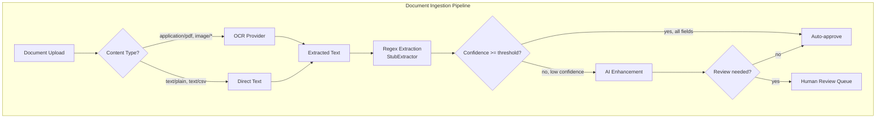
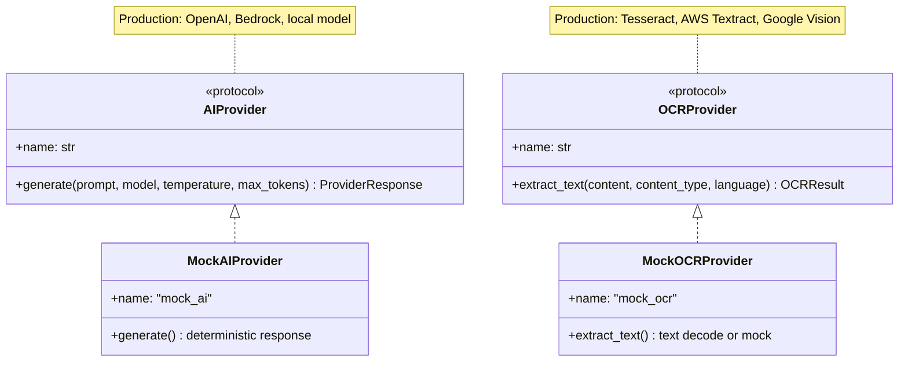
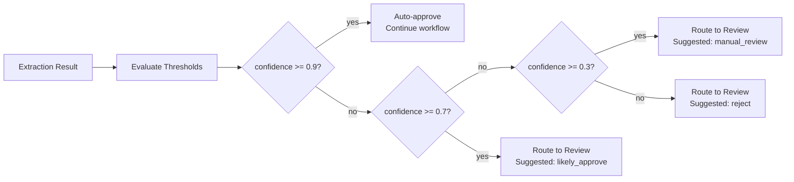

# AI Workflow Integration

## Overview

InsuranceOps AI extends the deterministic workflow orchestration platform with AI-assisted capabilities while preserving all existing guarantees: deterministic replay, bounded retries, audit chain integrity, and fail-safe routing.



## Provider Abstraction

All AI capabilities route through protocol interfaces with no vendor lock-in:



## Summarization Pipeline

Three summary types, all using the same `AIProvider` interface:

| Summary Type | Trigger | Audience |
|-------------|---------|----------|
| Workflow | On workflow completion/failure | Operations dashboard |
| Claim | After extraction step | Operator queue |
| Escalation | On escalation creation | Human reviewer |

All summarization is:
- **Fail-safe**: errors produce empty summaries, never crash the workflow
- **Replay-safe**: temperature=0.0 for deterministic output
- **Versioned**: prompt templates carry version identifiers tracked in audit metadata

## Human Review Routing

Confidence-based routing integrates with the existing escalation model:



Review decisions:
- **APPROVE**: workflow continues with existing extraction
- **REJECT**: workflow fails with rejection reason
- **REPROCESS**: triggers a new extraction attempt with adjusted parameters

## Execution Metadata

Every AI operation within a step is tracked:

```
AIStepMetadata
├── step_attempt_id
├── executions[]
│   ├── AIExecutionMetadata
│   │   ├── provider_name
│   │   ├── model
│   │   ├── prompt_version
│   │   ├── input_hash (replay detection)
│   │   ├── output_hash (change detection)
│   │   ├── confidence
│   │   ├── latency_ms
│   │   └── token_usage
│   └── ...
├── total_latency_ms
├── total_tokens
├── min_confidence
└── requires_review
```

This metadata is:
- Serialized into `step_attempt.output_ref` for persistence
- Included in AuditEvent payloads for audit trail
- Consumed by Prometheus metrics for operational observability

## Observability

AI-specific metrics (all Prometheus):

| Metric | Type | Labels | Purpose |
|--------|------|--------|---------|
| `ai_extraction_total` | Counter | provider, outcome | Extraction success/failure rate |
| `ai_extraction_duration_seconds` | Histogram | provider | Pipeline latency distribution |
| `ai_extraction_confidence` | Histogram | step_name | Confidence score distribution |
| `ai_ocr_duration_seconds` | Histogram | provider, content_type | OCR processing time |
| `ai_summarization_total` | Counter | summary_type, outcome | Summary generation rate |
| `ai_summarization_duration_seconds` | Histogram | summary_type | Summary latency |
| `ai_review_routed_total` | Counter | reason, suggested_action | Review routing decisions |
| `ai_review_decisions_total` | Counter | decision | Review outcomes |
| `ai_review_queue_depth` | Gauge | - | Pending review items |
| `ai_provider_calls_total` | Counter | provider, operation_type, outcome | Provider call volume |
| `ai_provider_tokens_total` | Counter | provider, token_type | Token consumption |
| `ai_provider_latency_seconds` | Histogram | provider, operation_type | Provider response time |

## Design Decisions

### Why mock providers ship first

The platform's correctness story depends on deterministic replay. Mock providers:
- Produce identical output for identical input (content-hash-based)
- Run without external service dependencies
- Enable full CI testing of the AI pipeline
- Serve as the reference implementation for real providers

### Why fail-safe, not fail-fast

AI operations are enhancement, not correctness-critical. If an AI call fails:
- OCR failure: fall back to raw text if available
- Summarization failure: empty summary, workflow continues
- Enhancement failure: use regex-only extraction, flag for review

The workflow never crashes due to an AI provider error.

### Why confidence thresholds are configurable

Different deployments have different accuracy requirements. The `ReviewThresholds` dataclass allows per-deployment tuning without code changes. Defaults are conservative (auto-approve at 0.9+, review below 0.7, reject below 0.3).
