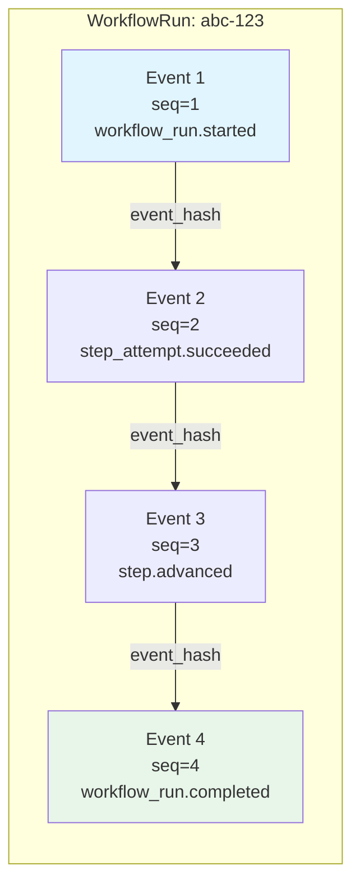
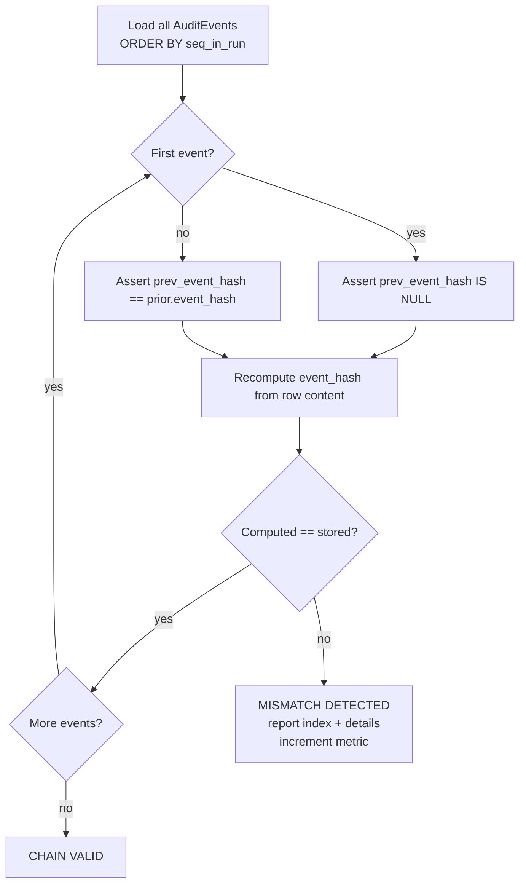

# Audit Chain

## Hash-Chain Construction

Every state transition in a WorkflowRun produces exactly one AuditEvent. Events are linked into a per-run hash chain that makes tampering detectable.



Each event stores:
- `prev_event_hash`: SHA-256 of the previous event's `event_hash` (NULL for first)
- `event_hash`: SHA-256 of the current event's canonical content

## Hash Computation Formula

```
event_hash = SHA-256(
    audit_event_id.bytes ||
    workflow_run_id.bytes ||
    actor.encode("utf-8") ||
    event_type.encode("utf-8") ||
    canonical_json(payload).encode("utf-8") ||
    occurred_at.isoformat().encode("utf-8") ||
    coalesce(prev_event_hash, b"")
)
```

`canonical_json` = sorted keys, no whitespace, `separators=(",", ":")`.

## Verification Flow



## Tamper Detection

If any field of any AuditEvent row is modified after insertion:

1. The recomputed `event_hash` will not match the stored value
2. All subsequent events' `prev_event_hash` will also mismatch
3. The verifier reports the **first** broken link

This detects:
- Payload modification (changing what happened)
- Actor modification (changing who did it)
- Timestamp modification (changing when it happened)
- Row deletion (gap in `seq_in_run`)
- Row insertion (chain fork)

## Immutability Enforcement

| Control | Mechanism |
|---------|-----------|
| No UPDATE on audit_events | DB role `app_rw` has INSERT + SELECT only |
| No DELETE on audit_events | DB role `app_rw` lacks DELETE |
| Serialized writes per run | `SELECT ... FOR UPDATE` on workflow_runs row |
| Monotonic seq_in_run | UNIQUE constraint on `(workflow_run_id, seq_in_run)` |

## Operational Commands

```bash
# Verify a single workflow run
./scripts/opsctl audit verify --workflow-run-id <UUID>

# Batch verify terminal runs
./scripts/opsctl audit verify-batch --sample-size 50 --state completed
```

The scheduled audit verifier runs automatically in the worker process (default: every hour, sample of 10 runs). Mismatches increment `audit_chain_mismatches_total` and log at CRITICAL level.
