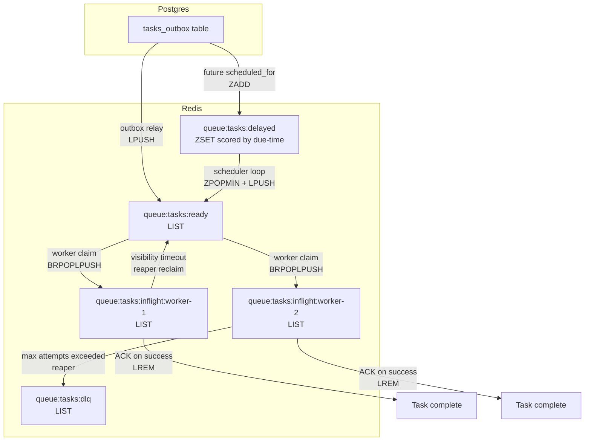

# Queue Topology

## Redis Reliable-Queue Structure

InsuranceOps AI uses a Redis-backed reliable queue with visibility-timeout semantics. No external queue broker is required.

## Key Patterns

| Redis Key | Type | Purpose | TTL |
|-----------|------|---------|-----|
| `queue:tasks:ready` | List | Main work queue; workers claim from tail | None |
| `queue:tasks:inflight:<worker_id>` | List | Per-worker in-flight tasks | None (reaped on timeout) |
| `queue:tasks:delayed` | Sorted Set | Future-scheduled tasks; score = epoch seconds | None |
| `queue:tasks:dlq` | List | Dead-letter queue for failed tasks | None |
| `queue:workers:heartbeat:<worker_id>` | String | Worker liveness signal | 30s TTL |
| `rate:api_key:<prefix>:<window>` | String | Rate-limit counter | window + 1s |

## Data Flow

1. **API creates WorkflowRun** - inserts `tasks_outbox` row in same transaction
2. **Outbox relay** - polls outbox, pushes to `ready` (immediate) or `delayed` (future)
3. **Worker claims** - `BRPOPLPUSH` atomically moves task from `ready` to `inflight:<worker_id>`
4. **Worker processes** - executes step handler, writes outcome to Postgres
5. **Worker ACKs** - `LREM` removes task from inflight list
6. **Reaper reclaims** - scans inflight lists for tasks past visibility timeout

## Failure Recovery

- **Worker crash**: task remains in inflight list; reaper returns it to `ready` after timeout
- **Redis flush**: no committed state lost; outbox relay re-drains pending rows
- **Poison pill**: task exceeds `max_attempts` and moves to DLQ for operator inspection
