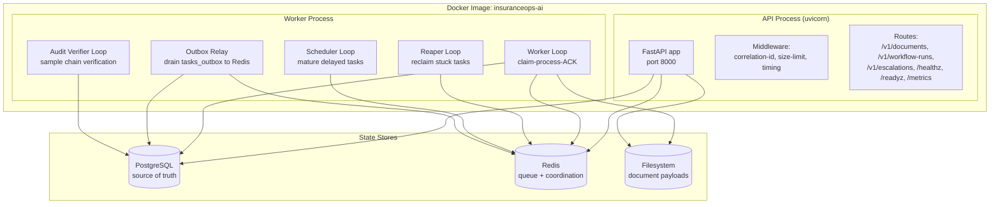
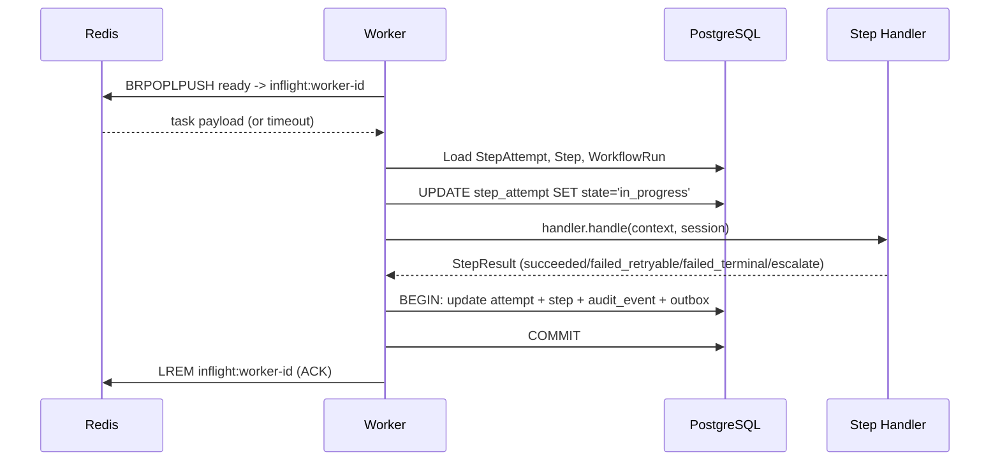

# Worker Architecture

## Process Topology

InsuranceOps AI runs as a single Docker image with two process types:

## Worker Concurrent Tasks

The worker process runs five concurrent async tasks, each independently controllable:

| Task | Purpose | Interval | Advisory Lock | CLI Flag to Disable |
|------|---------|----------|---------------|---------------------|
| Worker Loop | Claim and process tasks | Continuous (5s block timeout) | No | N/A (always runs) |
| Reaper | Reclaim stuck inflight tasks | 15s | No | `--no-reaper` |
| Scheduler | Promote delayed tasks to ready | 5s | Yes (Postgres) | `--no-scheduler` |
| Outbox Relay | Drain tasks_outbox to Redis | 2s | Yes (Postgres) | `--no-outbox` |
| Audit Verifier | Verify hash chains on sample | 3600s (configurable) | No | `--no-audit-verifier` |

## Worker Loop: Claim-Process-ACK

## Graceful Shutdown

On SIGTERM/SIGINT:
1. Shutdown event is set
2. All loop tasks check the event and exit their wait cycles
3. In-progress task finishes its current handler call
4. All tasks are cancelled
5. Redis and DB connections are closed
6. Process exits 0
