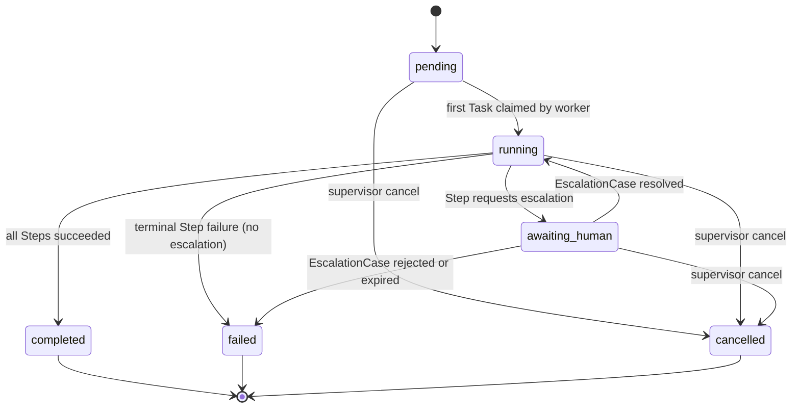
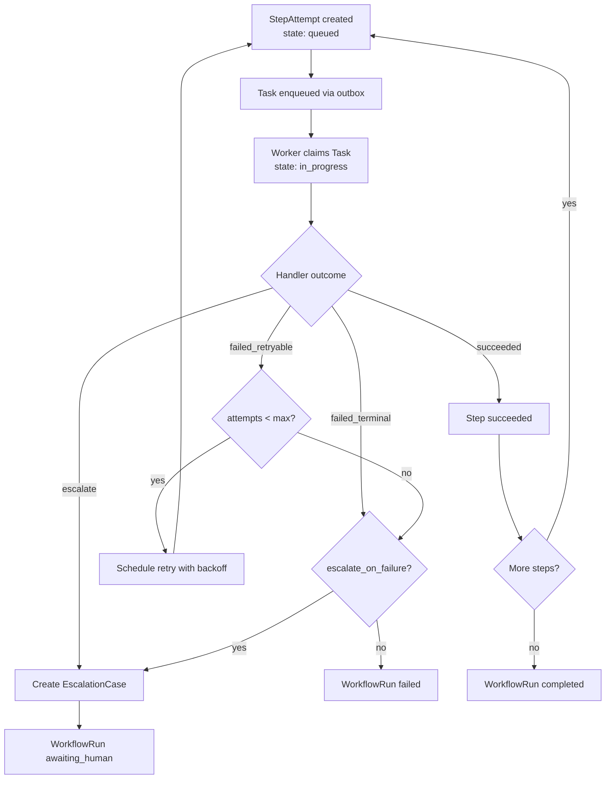

# Workflow Lifecycle

## WorkflowRun State Machine

Every WorkflowRun traverses a deterministic state machine. Only the transitions shown below are legal; any other transition is rejected and emits no AuditEvent.

## Step Execution Flow

Each Step within a WorkflowRun follows this sequence:

## claim_intake_v1 Workflow Steps

The default workflow executes five steps in order:

| Step | Handler | Max Attempts | Escalate on Failure |
|------|---------|--------------|---------------------|
| ingest | ingest | 1 | No |
| extract | extract | 3 | Yes |
| validate | validate | 1 | Yes |
| route | route | 2 | No |
| complete | complete | 1 | No |
